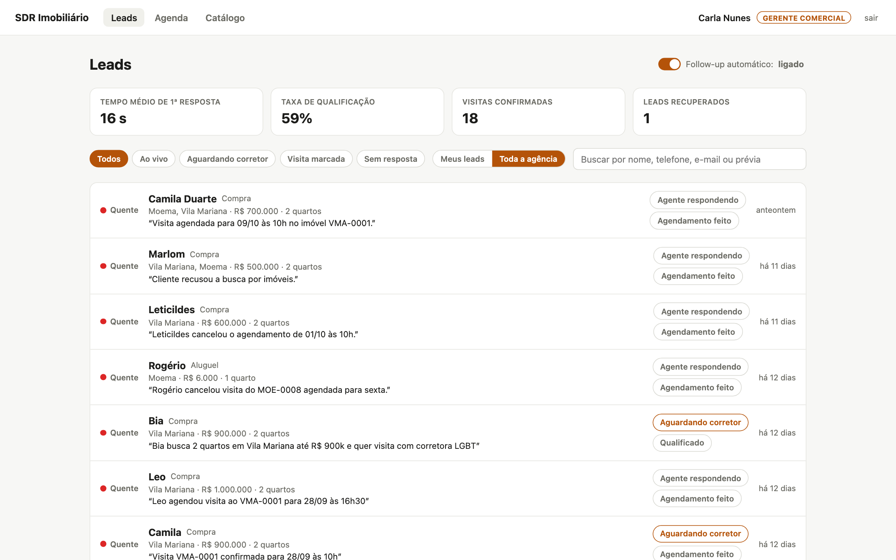
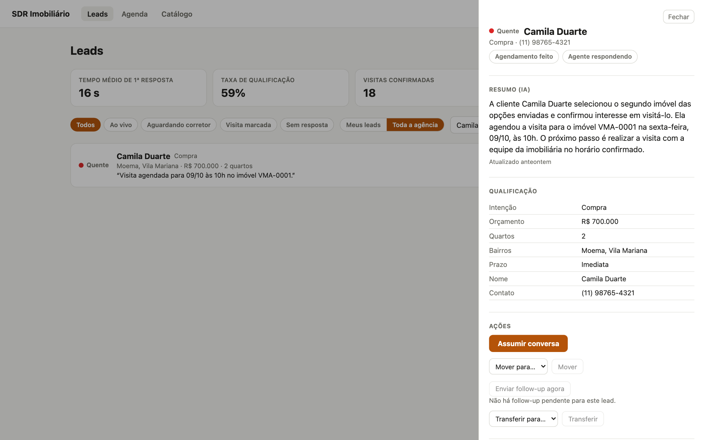
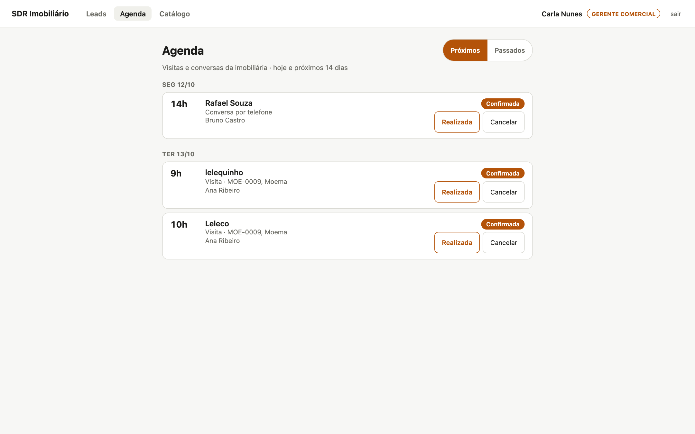
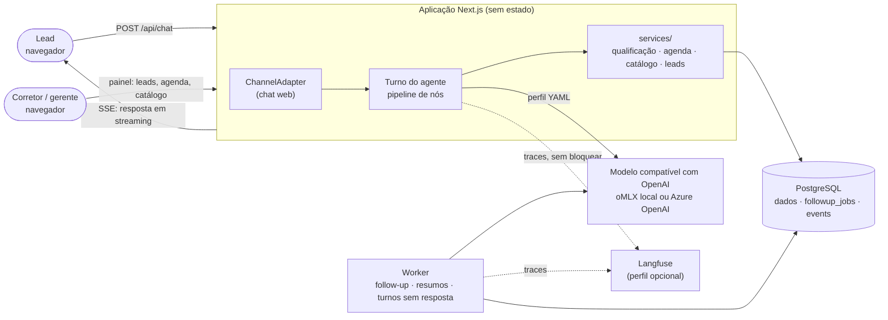
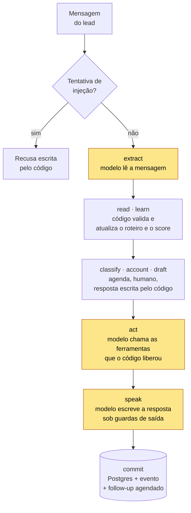

# Agente SDR Imobiliário — Sofia

POC de um **agente de IA para pré-atendimento e qualificação de leads no mercado imobiliário brasileiro**.
Tech Challenge — Fase 5 (Hackathon), FIAP.

A Sofia atende o lead no chat em segundos e entende se ele quer comprar, alugar ou investir. Ela qualifica
com uma pergunta por vez, mostra imóveis reais do catálogo e marca visita ou ligação na agenda do corretor.
Se o lead some, ela volta a falar com ele sem perder o contexto. O corretor acompanha tudo num painel com
resumo, score e agenda.

> **Estado da entrega:** funcional, rodando localmente com Docker Compose. O canal é um chat web (sem
> WhatsApp) e o modelo pode ser local (Gemma 4 via oMLX) ou hospedado (Azure OpenAI), escolhido por
> configuração.

## Guia rápido para a avaliação

| Pergunta | Onde está a resposta |
|---|---|
| Quais requisitos do desafio foram atendidos, e como? | [Requisitos × entrega](docs/requisitos.md): matriz completa com código, testes e conversas |
| Qual é a arquitetura? | [Arquitetura](#arquitetura), abaixo, e [`docs/arquitetura/`](docs/arquitetura/visao-geral.md) |
| Que IA é usada, e para quê? | [A IA utilizada](#a-ia-utilizada) |
| Como fica uma conversa de verdade? | [Conversas reais](docs/exemplos/conversas.md) e [Em imagens](#em-imagens) |
| Como a qualidade é medida? | [Avaliação e guardrails](#avaliação-e-guardrails) |
| Quais diferenciais foram implementados? | [Diferenciais](#diferenciais) |
| Como rodar? | [Como executar](#como-executar) |
| Como o projeto foi construído? | [Como o projeto foi construído](#como-o-projeto-foi-construído) |

---

## O problema

Imobiliárias pagam caro por cada lead (de R$ 30 a R$ 150, dependendo do canal) e perdem boa parte deles por
motivos banais:

- **Tempo de resposta.** O lead que chega às 22h de sábado fala com o concorrente antes de falar com você.
- **Falta de follow-up.** Quem não responde à primeira mensagem é abandonado.
- **Falta de priorização.** O corretor trata igual quem quer comprar em 30 dias e quem está só olhando.
- **Sobrecarga.** O corretor faz triagem em vez de vender.

## A solução

Um **SDR digital** que atende 24 horas por dia em conversa natural:

1. **Atende e entende a intenção**: compra, aluguel ou investimento. A intenção pode mudar no meio da conversa.
2. **Qualifica** com uma pergunta por mensagem: orçamento, quartos, bairros e urgência. Para quem investe, o
   roteiro pergunta perfil, ticket e expectativa de retorno.
3. **Consulta o catálogo** (100 imóveis semeados em São Paulo) e mostra cartões de imóveis que existem e
   respeitam o filtro.
4. **Agenda** visita ou ligação em horários reais da agenda do corretor. Também remarca e cancela.
5. **Calcula um score** de 0 a 100 (frio, morno ou quente), visível no painel.
6. **Resume a conversa** para o corretor.
7. **Faz follow-up** sozinho quando o lead some, retomando do ponto em que parou.
8. **Passa para um humano** quando o lead pede, ou quando não consegue entender.

**A IA não fecha venda.** Ela protege o tempo do corretor e evita que o lead esfrie.

## Em imagens

<!-- Capturas da aplicação real. O que cada uma mostra, e que mudança obriga a refazê-la, está em
     docs/imagens/README.md; scripts/screenshots/ refaz todas com o mesmo enquadramento. -->

| Chat do lead (compra) | Painel do corretor |
|---|---|
|  |  |
| **Painel do lead: resumo e qualificação** | **Agenda da imobiliária** |
|  |  |

Mais telas: [chat de investimento](docs/imagens/chat-investimento.png) ·
[follow-up](docs/imagens/chat-followup.png) · [guardrails](docs/imagens/chat-guardrails.png) ·
[cartões de imóveis](docs/imagens/chat-compra-cartoes.png) ·
[painel do lead investidor](docs/imagens/painel-lead-investimento.png) ·
[catálogo](docs/imagens/catalogo.jpg) · [*trace* de um turno no Langfuse](docs/imagens/langfuse-trace.png).

---

## Arquitetura

Monolito modular: uma aplicação Next.js sem estado, com fronteiras internas rígidas, e um **worker** separado
(mesma imagem, outro comando) para o trabalho assíncrono. Todo o estado mora no PostgreSQL, inclusive a fila
de jobs e o *outbox* de eventos.



**Um turno do agente.** O código decide; o modelo é chamado em três pontos (em destaque) e só lê, escolhe
ferramentas que o código ofereceu ou escreve a frase.



| Camada | Escolha |
|---|---|
| Aplicação | Next.js 16 (App Router) + TypeScript `strict` |
| IA | Vercel AI SDK (`ai` 7) com provedor compatível com OpenAI; um perfil YAML por modelo |
| Banco | PostgreSQL 17 + Drizzle ORM |
| Assíncrono | `followup_jobs` + *outbox* `events` no próprio Postgres (`FOR UPDATE SKIP LOCKED`); tempo real por `LISTEN/NOTIFY` → SSE. Sem Redis na aplicação |
| Observabilidade | Langfuse self-hosted (perfil `observability` do Compose), logs JSON com pino, *health checks* |
| Execução | Docker Compose: `db`, `migrate`, `app`, `worker` |

**Organização e componentização.** As camadas seguem uma regra de dependência: `app → services → db`,
`agent → services`, e `domain/` não importa nada (regras puras, testadas por tabela). Há duas costuras com
mais de uma implementação prevista: `ChannelAdapter` (WhatsApp entraria aqui) e o perfil de modelo. Nenhum
módulo passa de 1000 linhas. O turno é uma sequência de nós tipados em [`src/agent/turn/`](src/agent/turn/run.ts).

**Escalabilidade.** A aplicação não guarda estado, o estado fica no Postgres e o worker já é um processo
separado. Mais réplicas do app e do worker funcionam sem mudança de código: os jobs são reivindicados com
`SKIP LOCKED`, e dois workers produzem um único resumo por conversa (testado). O caminho de escala, e o que
ainda não foi feito (deploy em nuvem), está na visão geral.

**Documentos de arquitetura:**

- [Visão geral](docs/arquitetura/visao-geral.md): componentes, fluxos, segurança e caminho de escala
- [Turno do agente](docs/arquitetura/turno-do-agente.md): o que o modelo lê, o que o código decide e quais ferramentas existem em cada turno
- [Modelo de dados](docs/arquitetura/modelo-de-dados.md): tabelas, roteiro de qualificação e score
- [Decisões de arquitetura (ADRs)](docs/arquitetura/adr/decisoes.md): 24 decisões, com contexto e consequências
- [Restrições de implantação](docs/arquitetura/restricoes-de-implantacao.md) e [configurações](docs/arquitetura/configuracoes.md)

---

## Como os requisitos são atendidos

Resumo abaixo; a matriz completa, com arquivo e teste para cada item, está em
[**docs/requisitos.md**](docs/requisitos.md).

| Requisito funcional | Como |
|---|---|
| Atendimento conversacional | Chat web com resposta em *streaming*, "digitando…" e reconexão automática |
| Conversa natural | O modelo escreve; o código dita só o que perguntar. Guardas barram mais de uma pergunta, outro idioma e números inventados |
| Fluxo humanizado | Persona Sofia, que se apresenta como assistente virtual. Pede consentimento antes de guardar dados, oferece um humano quando não sabe e transfere a conversa quando o lead pede |
| Continuidade da conversa | Histórico e estado no Postgres; o chat retoma a conversa ao reabrir; o follow-up retoma com contexto |
| Qualificação de leads | Roteiro por intenção, score de 0 a 100 e temperatura, recalculados a cada turno |
| Agendamento de reuniões | Horários reais por corretor e especialização; propor, confirmar, remarcar e cancelar |
| Resumo inteligente | O worker resume cada conversa para o corretor, com uma linha de prévia na lista |
| Dashboard mínimo | Leads ao vivo, indicadores do funil, painel do lead (assumir, devolver, transferir), agenda e catálogo |

**Os três cenários do enunciado**, com as mensagens do próprio enunciado, rodando de verdade (trechos; a
íntegra está em [`docs/exemplos/conversas.md`](docs/exemplos/conversas.md)):

**Exemplo 1: compra.** Roteiro completo, imóveis reais e visita marcada
([conversa completa](docs/exemplos/conversas.md#1-compra) · [tela](docs/imagens/chat-compra.png)).

> **Lead:** Estou procurando apartamento na zona sul
>
> **Sofia:** Entendi que você busca um apartamento na zona sul. Qual faixa de preço você tem em mente?
>
> **Lead:** Até uns 700 mil
>
> **Sofia:** Entendi, então o seu limite é de até R$ 700 mil. Quantos quartos você precisa no apartamento?
>
> *… quartos, bairros e prazo …*
>
> **Sofia:** Entendi que você precisa se mudar em até 2 meses. Separei 3 opções que combinam com o que você me contou […] *(3 cartões do catálogo)*
>
> *… nome e telefone …*
>
> **Lead:** Gostei do segundo
>
> **Sofia:** Tenho estes horários para uma visita ao VMA-0001 com alguém da nossa equipe: 1) sex 09/10 às 10h · 2) sex 09/10 às 14h · 3) sex 09/10 às 16h30. Qual fica melhor?
>
> **Lead:** Pode ser o primeiro horário
>
> **Sofia:** Pronto! Sua visita ao VMA-0001 está confirmada para sex 09/10 às 10h, com alguém da nossa equipe.

**Exemplo 2: investimento.** Perfil, ticket e retorno, sem catálogo, e uma ligação com o especialista em
investimentos, o corretor do seed com essa especialização ([conversa completa](docs/exemplos/conversas.md#2-investimento) ·
[tela](docs/imagens/chat-investimento.png)).

> **Lead:** Quero investir em imóveis para renda
>
> **Sofia:** Entendi perfeitamente, seu foco é garantir uma boa renda mensal com aluguel. Essa seria sua primeira vez investindo em imóveis ou você já atua no setor?
>
> **Lead:** Seria o primeiro, hoje só tenho tesouro direto e ações
>
> **Sofia:** […] Qual valor você pensa em destinar para esse investimento?
>
> **Lead:** Algo em torno de 350 mil
>
> *… nome e e-mail …*
>
> **Sofia:** Tenho estes horários para uma conversa por telefone com nosso especialista em investimentos: 1) seg 12/10 às 10h · 2) seg 12/10 às 14h · 3) seg 12/10 às 16h30. Qual fica melhor?
>
> **Lead:** Pode ser a segunda opção
>
> **Sofia:** Pronto! Sua conversa por telefone está confirmada para seg 12/10 às 14h, com nosso especialista em investimentos.

**Exemplo 3: follow-up.** O lead parou de responder; o worker retomou com o contexto, e o lead voltou
([conversa completa](docs/exemplos/conversas.md#3-follow-up) · [tela](docs/imagens/chat-followup.png)).

> **Sofia:** Entendi, você busca algo até R$ 4.000 por mês. Quantos quartos você precisa no apartamento?
>
> *(silêncio)*
>
> **Sofia:** Oi! Passando para retomar sua busca por um apartamento de aluguel com orçamento de até R$ 4.000. 🏠 Quantos quartos você precisa?
>
> **Lead:** Oi! Desculpa a demora, foi uma semana corrida. 2 quartos
>
> **Sofia:** Sem problemas, eu entendo como as semanas podem ser corridas! Já anotei aqui que você precisa de 2 quartos. Você tem algum bairro ou região específica em mente ou aceita sugestões?

As conversas completas também mostram uma mudança de ideia (de aluguel para compra) e os guardrails: tentativa
de *prompt injection*, pergunta fora do escopo, pedido de desconto e pedido de corretor. Todas foram geradas
com o Gemma 4 12B local e estão sem edição, inclusive nos pontos em que o modelo errou, que estão comentados.

---

## A IA utilizada

**Modelos.** Qualquer modelo com API compatível com OpenAI, escolhido por **perfil** em
[`config/models/`](config/models/) (uma linha no `.env`: `MODEL_PROFILE=…`):

| Perfil | Modelo | Uso |
|---|---|---|
| `omlx_gemma4_e4b` | Gemma 4 e4b, 4 bits, local (oMLX em Apple Silicon) | desenvolvimento e todos os testes |
| `omlx_gemma4_12b` | Gemma 4 12B, 4 bits, local | diagnóstico (falha do modelo ou do código?) e as conversas de exemplo |
| `azure_nano` | gpt-5.4-nano, Azure OpenAI | demonstração com modelo hospedado |
| `azure_luna_none` | gpt-6-luna sem raciocínio, Azure OpenAI | demonstração com modelo hospedado |

**Princípio: o código decide, o modelo conversa.** Um modelo pequeno, local e de 4 bits só segura um
atendimento comercial se não decidir nada que custe caro. Por isso:

| Quem decide | O quê |
|---|---|
| **Código** (determinístico, testado) | qual a próxima pergunta, quando o roteiro acabou, o score, quais imóveis existem e quanto custam, quais horários estão livres, com qual corretor, quando passar para um humano, quando fazer follow-up |
| **Modelo** | ler a mensagem (extração em JSON), escolher entre as ferramentas liberadas no turno (buscar imóveis, reservar e remarcar), escrever a resposta da Sofia, resumir a conversa e escrever a mensagem de follow-up |

Cada turno faz duas ou três chamadas ao modelo, e cada uma é conferida pelo código:

- **Extração:** o JSON passa por schema, por regras de *merge* e por uma trava de evidência que descarta
  valores sobre assuntos que o lead nem mencionou. Uma resposta que não vem em JSON, ou uma chamada que
  falha, ganha uma segunda tentativa (o resumo também). Se as duas falharem, o lead recebe uma resposta
  honesta, e duas falhas seguidas passam a conversa para um humano. Cada tentativa falha aparece como
  `ERROR` no Langfuse.
- **Ferramentas:** só as que o código liberou naquele turno; os argumentos que importam (imobiliária,
  intenção) vêm do estado, não do modelo.
- **Resposta:** sai em *streaming* frase a frase, passando por guardas que retêm sintaxe vazada, outro
  idioma, mais de uma pergunta ou um valor em reais que nenhuma busca retornou.

Os detalhes estão no [turno do agente](docs/arquitetura/turno-do-agente.md). O que foi medido para chegar a
esse desenho (formato da chamada, redação do prompt, a trava de evidência) está em
[`evals/README.md`](evals/README.md).

**Por que não LangGraph nem multiagentes autônomos?** O fluxo de um SDR é curto e regrado, e cada decisão
movida do modelo para o código foi um defeito a menos nos testes com o modelo de 4 bits. O registro está nas
[ADRs 14 e 22](docs/arquitetura/adr/decisoes.md).

---

## Avaliação e guardrails

A qualidade foi medida em três níveis, do mais barato ao mais caro:

1. **Suíte determinística** (`npm run test:integration`, cerca de 430 testes em ~1 min): regras puras, banco
   real e um **modelo roteirizado** (`tests/support/scripted-model.ts`), de modo que as decisões do turno são
   testadas sem depender da sorte do *sampler*.
2. **Evals com o modelo real** (`npm run eval`, 58 verificações em [`tests/eval/`](tests/eval/), ~6 min no
   e4b local): os cenários do enunciado ponta a ponta e o comportamento da agenda.
3. **Eval de extração** ([`evals/`](evals/README.md)): 18 mensagens reais rotuladas, rodadas várias vezes
   cada. Um caso só passa se acerta sempre, porque o lead tem um turno só.

Na última execução antes da entrega, as evals passaram 58/58 no e4b e a suíte determinística 431/431.

| O que é verificado | Onde |
|---|---|
| Cenário 1 (compra) ponta a ponta: roteiro completo, uma pergunta por mensagem, todo imóvel mostrado existe e respeita o filtro, oferta de visita | `tests/eval/scenario-purchase.test.ts` |
| Cenário 2 (investimento) ponta a ponta: roteiro de investidor, catálogo nunca consultado, ligação | `tests/eval/scenario-investment.test.ts` |
| Cenário 3 (follow-up): a retomada traz contexto e termina na pergunta pendente | `tests/eval/followup-writer.test.ts`, `tests/integration/followup-send.test.ts` |
| Agenda: reservar, horário fora do expediente, dois leads no mesmo horário, remarcar, cancelar só com confirmação, limite de três compromissos | `tests/eval/booking.test.ts`, `tests/eval/changes.test.ts` |
| Saídas de uma oferta: recusa reconhecida uma vez, "só de manhã", mudança de assunto, revisão do pedido | `tests/eval/meeting-escapes.test.ts`, `tests/eval/offer-once.test.ts` |
| O que a Sofia não sabe resolver (videochamada, escolher corretor por traço pessoal, pedidos fora do escopo): diz que não consegue e oferece a equipe, sem inventar | `tests/eval/meeting-limits.test.ts`, `tests/boundary.test.ts`, `tests/integration/scripted-boundary.test.ts` |
| *Prompt injection*: três camadas (estrutura, entrada, saída) e cinco ataques roteirizados | `tests/injection.test.ts` |
| Guardas de saída: idioma, sintaxe vazada, valores não respaldados, número de perguntas | `tests/reply-guards.test.ts` |
| Passagem para humano: pedido explícito, duas mensagens não entendidas; corretor assume e devolve | `tests/handoff.test.ts`, `tests/integration/handoff.test.ts`, `tests/integration/handback.test.ts` |
| Dados pessoais mascarados nos *traces* e nos logs | `tests/masking.test.ts`, `tests/span-mask.test.ts` |
| Escopo: o corretor só vê os próprios leads; a gerente vê a imobiliária | `tests/integration/leads-scope.test.ts`, `tests/agenda-scope.test.ts` |
| Queda do modelo: o lead recebe uma resposta honesta, e o worker responde depois | `tests/provider-failure.test.ts`, `tests/integration/provider-outage.test.ts` |

As falhas encontradas pelo caminho, inclusive as que ficaram abertas, estão registradas com dono em
[`docs/cenarios-de-falha.md`](docs/cenarios-de-falha.md).

---

## Diferenciais

| Diferencial | Estado | Evidência |
|---|---|---|
| Memória conversacional | ✅ | Histórico, qualificação revisável e resumo persistidos por conversa; follow-up e retorno do lead partem desse estado |
| Observabilidade | ✅ | Langfuse self-hosted com *trace* de cada chamada (perfil e modelo inclusos, dados pessoais mascarados, tentativas que falharam marcadas como `ERROR`), logs JSON e *health checks* do app e do worker |
| Segurança | ✅ | Login e sessão assinada, escopo por imobiliária e corretor, três camadas contra *prompt injection*, consentimento (LGPD), orçamento de mensagens, mascaramento de PII |
| Multiagentes | 🟡 | Papéis de modelo separados (leitura, resposta, resumo, follow-up), não agentes autônomos. O agente especialista em investimento foi cortado |
| Uso de RAG | ❌ | O catálogo é consultado por ferramenta estruturada, o que garante que todo imóvel citado existe. Não há busca semântica |
| Integração com WhatsApp | ❌ | A costura existe (`ChannelAdapter`); só o chat web foi implementado |
| Voice AI · Integração com CRM · Deploy em cloud | ❌ | Fora da entrega. Já existem a imagem de produção, a configuração só por ambiente e o modelo hospedado na Azure |

Detalhes e arquivos: [docs/requisitos.md §4](docs/requisitos.md#4-diferenciais).

---

## Como executar

**Pré-requisitos:** Docker e Docker Compose. Para o modelo local, o [oMLX](https://omlx.ai/) rodando no host
(Apple Silicon; ver [restrições de implantação](docs/arquitetura/restricoes-de-implantacao.md)). A
alternativa é qualquer endpoint compatível com OpenAI, como a Azure OpenAI.

```bash
cp .env.example .env
```

Preencha `OMLX_API_KEY` (ou as chaves da Azure, abaixo). O resto já vem com padrão funcional.

```bash
docker compose up
```

| Serviço | Endereço |
|---|---|
| **Chat do lead** | **http://localhost:3100/chat/demo** |
| Painel (login) | http://localhost:3100/login |
| Saúde da aplicação | http://localhost:3100/api/health · `/api/health/ready` |
| Saúde do worker | http://localhost:3101/health · `/health/ready` |
| Langfuse (perfil `observability`) | http://localhost:3102 |
| Postgres | `localhost:55432` |

Abra o chat numa janela estreita ou no celular, aceite o termo e converse. `demo` é o *slug* da imobiliária
semeada.

**Usuários semeados** (senha `demo1234`, só para desenvolvimento local):

| E-mail | Papel | O que vê |
|---|---|---|
| `carla@demo.com.br` | gerente comercial (Carla Nunes) | todos os leads e a agenda da imobiliária; liga e desliga o follow-up automático |
| `ana@demo.com.br` | corretora (Ana Ribeiro) · compra e aluguel | *Meus leads* e as próprias visitas |
| `bruno@demo.com.br` | corretor (Bruno Castro) · investimento e compra | idem |

### Trocar de modelo

O `.env` escolhe o perfil e guarda as chaves (ADR 23). Para a Azure:

```bash
AZURE_OPENAI_BASE_URL=https://<recurso>.openai.azure.com/openai/v1
AZURE_OPENAI_API_KEY=<a chave do recurso>
MODEL_PROFILE=azure_luna_none
```

Depois reinicie a aplicação e o worker:

```bash
docker compose up -d app worker
```

O Langfuse mostra, em cada turno, qual perfil e qual modelo responderam.

### Testes e verificações

```bash
docker compose exec app npm test
```

```bash
docker compose exec app npm run lint
```

```bash
docker compose exec app npm run doctor
```

O `doctor` responde *alcançável*, *falha de autenticação* ou *inalcançável*.

**Suíte de integração e evals.** Usam um banco próprio (`sdr_test`, recriado a cada execução) e um app
próprio (`app-test`, porta 3200), nunca a demo. Rodam sempre no e4b local, qualquer que seja o perfil do
`.env`. Suba o app de teste uma vez:

```bash
docker compose --profile test up -d app-test
```

```bash
docker compose exec app npm run test:integration
```

```bash
docker compose exec app npm run eval
```

```bash
docker compose exec app node evals/extraction.mjs --runs 8
```

**Observabilidade** (desligada por padrão; a aplicação funciona igual sem ela):

```bash
docker compose --profile observability up -d
```

**Voltar o banco ao estado de demonstração** (apaga as conversas e semeia de novo):

```bash
docker compose exec app npm run db:reset
```

**Imagem de produção**, construída fora do Compose:

```bash
docker build --target runner -t sdr-imobiliario .
```

**Testar no celular** (mesma rede): abra `http://<nome-do-mac>.local:3100/chat/demo`. Pelo IP, inclua-o em
`DEV_ALLOWED_ORIGINS` no `.env` e recrie o app.

---

## Como o projeto foi construído

O projeto foi construído por agentes de código (Claude Code e Cursor) conduzidos por um desenvolvedor, com
regras fixas numa [constituição](.specify/memory/constitution.md) e as decisões registradas em
[ADRs](docs/arquitetura/adr/decisoes.md).

**Primeiro, desenvolvimento orientado a especificação com o [GitHub Spec Kit](https://github.com/github/spec-kit).**
As specs 001 a 007 seguiram o fluxo completo: especificar, esclarecer, planejar, quebrar em tarefas, analisar
a consistência e implementar. Cada pasta em [`specs/`](specs/) traz spec, plano, contratos e tarefas. Foi
valioso no começo, quando o modelo de dados e o turno ainda eram incertos.

**Depois, um processo mais leve.** O Spec Kit gerava mais requisitos inventados do que um desenvolvedor sozinho
conseguia revisar. A partir da spec 009, cada mudança passou a ter uma **spec de uma página em prosa**: o que
cobre, o que não cobre e como se verifica (009, [015](specs/015-fronteira/spec.md),
[016](specs/016-model-provider/spec.md)). Hoje a spec é oferecida, não exigida (ADR 24). O que continua
obrigatório é a suíte determinística passando antes de cada *merge* e o mapa do turno atualizado junto com o
código do turno.

O [backlog](specs/BACKLOG.md) liga cada fatia ao requisito do desafio que ela atende. As specs 008 e 010 a
014 (score sem teto, agente especialista em investimento, RAG/FAQ, voz e outras) foram cortadas para a
entrega.

---

## Limitações conhecidas

- **Modelo local pequeno:** o e4b às vezes ignora uma pergunta lateral ("ele tem varanda?") quando o lead
  também escolhe um imóvel. Os casos conhecidos estão em [`docs/cenarios-de-falha.md`](docs/cenarios-de-falha.md).
- **Latência local:** no 12B, um turno leva dezenas de segundos numa máquina de desenvolvimento; um modelo
  hospedado responde em poucos segundos.
- **Canal único e sem deploy:** só chat web, só local.

## Estrutura do repositório

| Pasta | Conteúdo |
|---|---|
| `src/agent/` | o turno (`turn/`), prompts, ferramentas e provedor do modelo |
| `src/domain/` | regras puras: roteiro, score, agenda, guardas, passagem para humano |
| `src/services/` | casos de uso e consultas: a única porta de entrada da UI e da API |
| `src/app/` | rotas Next.js: chat público, painel, API |
| `src/jobs/`, `src/worker/` | follow-up, resumos e turnos sem resposta, no worker |
| `config/models/` | perfis de modelo |
| `docs/` | arquitetura, requisitos, exemplos, decisões e falhas conhecidas |
| `specs/` | especificações por funcionalidade |
| `tests/`, `evals/` | suíte determinística, evals com modelo real e eval de extração |
| `scripts/` | diagnóstico (`doctor`), [conversas de exemplo](scripts/sample-conversations/README.md) e [capturas de tela](scripts/screenshots/README.md) |
| `reference/` | ideação inicial, **não normativa** ([`reference/README.md`](reference/README.md)) |

**Convenções:** código, identificadores e commits em inglês; documentação, interface e conversa em pt-BR.
Os termos de domínio são traduzidos pelo glossário em [`AGENTS.md`](AGENTS.md).
