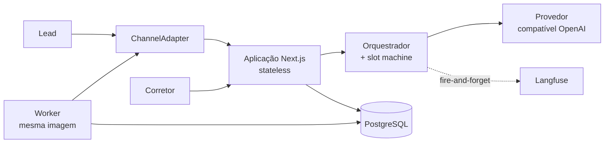

# Agente SDR Imobiliário

POC de um **agente de IA para pré-atendimento e qualificação de leads no mercado
imobiliário brasileiro**. Tech Challenge — Fase 5, FIAP.

> **Status:** projeto em configuração. A stack de execução chega na primeira spec
> do backlog. Ver [Como executar](#como-executar).

---

## O problema

Imobiliárias pagam caro por cada lead — entre R$ 30 e R$ 150, dependendo do canal —
e desperdiçam boa parte deles por três motivos banais:

- **Tempo de resposta.** O lead que chega às 22h de sábado fala com o concorrente
  antes de falar com você.
- **Falta de follow-up.** Quem não responde à primeira mensagem é abandonado.
- **Falta de priorização.** O corretor trata igual quem quer comprar em 30 dias e
  quem está só olhando.

## A solução

Um **SDR digital** que atende em segundos, 24 horas por dia, em conversa natural.
Identifica se o cliente quer comprar, alugar ou investir; coleta orçamento, região,
quartos e urgência; consulta o catálogo e sugere imóveis reais; propõe horários de
visita; e entrega ao corretor um lead já qualificado com resumo pronto. Se o lead
some, o agente volta sozinho — mantendo o contexto da conversa anterior.

O corretor deixa de ser recepcionista e volta a ser vendedor.

**A IA não fecha venda.** Ela protege o tempo do corretor e evita que o lead esfrie.

---

## Arquitetura

Monolito modular: uma aplicação Next.js stateless, com fronteiras internas rígidas
e um worker como processo separado desde o primeiro dia.



| Camada | Escolha |
|---|---|
| Aplicação | Next.js (App Router) + TypeScript `strict` |
| Orquestração do agente | Vercel AI SDK |
| Modelo | Provedor compatível com OpenAI — oMLX local, trocável por endpoint hospedado |
| Banco | PostgreSQL + Drizzle ORM |
| Assíncrono | `followup_jobs` + outbox `events` no próprio Postgres — **sem Redis** |
| Observabilidade | Langfuse |
| Execução | Docker Compose — `app`, `worker`, `db` |

Três propriedades sustentam a escala sem reescrita: a aplicação é **stateless**, o
estado é **externalizado**, e o worker já é **processo separado**. Detalhes e o
caminho de escala em [`docs/arquitetura/visao-geral.md`](docs/arquitetura/visao-geral.md).

---

## Como executar

**Pré-requisitos:**

- Docker e Docker Compose — **única exigência obrigatória**
- [oMLX](https://omlx.ai/) rodando no host, para inferência local em Apple Silicon.
  Não é containerizável; ver
  [restrições de implantação](docs/arquitetura/restricoes-de-implantacao.md).
  Alternativa: qualquer endpoint compatível com OpenAI, configurado por variável de
  ambiente.

```bash
cp .env.example .env
```

Preencha `OMLX_API_KEY` com a chave configurada no oMLX — é o único valor que
um clone limpo não consegue preencher sozinho. Todo o resto já vem com padrão
funcional. Depois:

```bash
docker compose up
```

### Trocar de modelo (perfis)

Cada modelo tem um perfil em [`config/models/`](config/models/): endpoint, modelo, cabeçalho de autenticação,
raciocínio e tetos de saída. O `.env` só escolhe o perfil e guarda as chaves (ADR 23):

| Perfil | Modelo |
|---|---|
| `omlx_gemma4_e4b` | e4b local — desenvolvimento e testes (padrão) |
| `omlx_gemma4_e4b_thinking` | o mesmo, com o raciocínio do oMLX ligado |
| `omlx_gemma4_12b` | 12B local — só para separar falha de modelo de falha de código |
| `azure_nano` | gpt-5.4-nano na Azure OpenAI |
| `azure_luna_none` | gpt-6-luna na Azure OpenAI, sem raciocínio |
| `azure_luna_low` | gpt-6-luna com raciocínio baixo — **sem ferramentas**: a Azure as recusa nesse modo, então busca e agendamento falham |

Para usar a Azure, preencha uma vez no `.env`:

```bash
AZURE_OPENAI_BASE_URL=https://<recurso>.openai.azure.com/openai/v1
AZURE_OPENAI_API_KEY=<a chave do recurso>
```

A troca é uma linha, `MODEL_PROFILE=azure_nano` (ou outro perfil), e depois reinicie a aplicação e o worker:

```bash
docker compose up -d app worker
```

Para voltar ao modelo local, `MODEL_PROFILE=omlx_gemma4_e4b` e reinicie do mesmo jeito. O Langfuse mostra em cada
turno qual perfil e qual modelo responderam. Os testes rodam sempre no e4b local, seja qual for o perfil do `.env`.

| Serviço | Endereço |
|---|---|
| Aplicação | http://localhost:3100 |
| **Chat do lead** | **http://localhost:3100/chat/demo** |
| Saúde da aplicação | http://localhost:3100/api/health · `/api/health/ready` |
| Saúde do worker | http://localhost:3101/health · `/health/ready` |
| Postgres | `localhost:55432` |

O chat é a demonstração: abra `/chat/demo` no celular ou numa janela estreita,
aceite o termo e converse. `demo` é o *slug* da imobiliária semeada.

**Usuários semeados** — entre em http://localhost:3100/login. Todos com a senha
`demo1234`, só para desenvolvimento local:

| E-mail | Papel | O que vê |
|---|---|---|
| `carla@demo.com.br` | gerente comercial (Carla Nunes) | todos os leads e a agenda da imobiliária; liga e desliga o follow-up automático |
| `ana@demo.com.br` | corretora (Ana Ribeiro) | começa em *Meus leads*; a agenda mostra só as visitas dela |
| `bruno@demo.com.br` | corretor (Bruno Castro) | idem, com os leads e as visitas dele |

Vêm de `src/db/seed/index.ts` (`npm run db:seed`, que é idempotente).

**Testar no celular** (mesma rede Wi-Fi): abra `http://<nome-do-mac>.local:3100/chat/demo` — o nome aparece em
Ajustes do Sistema › Geral › Compartilhamento, e funciona sem configurar nada. Pelo IP
(`ipconfig getifaddr en0`), coloque o IP em `DEV_ALLOWED_ORIGINS` no `.env` e rode
`docker compose up -d --force-recreate app`. Sem isso o `next dev` bloqueia o JavaScript para outros aparelhos
e o chat fica em *"Carregando a conversa…"*.

As portas evitam de propósito as mais disputadas (3000, 5432, 8000, 8001, 80) para
o projeto conviver com outros na mesma máquina. Para movê-las, altere `APP_PORT`,
`WORKER_HEALTH_PORT` ou `DB_PORT` no `.env` — nada mais precisa mudar.

**Verificar se o contêiner alcança o modelo:**

```bash
docker compose exec app npm run doctor
```

Responde *alcançável*, *falha de autenticação* ou *inalcançável* — três resultados
distintos, para que um problema de rede não seja confundido com uma chave errada.

**Testes e verificações:**

```bash
docker compose exec app npm test
```

```bash
docker compose exec app npm run lint
```

#### Testes de integração

A suíte de integração fala com o banco, com o modelo local e com um app rodando de
verdade. Ela nunca toca a demo: usa um **banco só dela** (`sdr_test`), recriado,
migrado e populado a cada execução, e um **app só dela** (`app-test`, porta 3200),
o mesmo código apontado para esse banco. Traces que esse app manda ao Langfuse
ficam no ambiente `test`.

Uma vez, suba o app de teste (ele fica rodando, como o resto do stack):

```bash
docker compose --profile test up -d app-test
```

Depois, sempre que quiser rodar a suíte:

```bash
docker compose exec app npm run test:integration
```

Um arquivo só, no mesmo banco novo:

```bash
docker compose exec app npm run test:integration -- tests/integration/booking.test.ts
```

Se o `app-test` não estiver respondendo, a execução **falha** e mostra o comando
para subi-lo — os testes HTTP não somem por esquecimento. Para rodar sem eles, de
propósito:

```bash
docker compose exec -e SKIP_HTTP_TESTS=1 app npm run test:integration
```

Quanto o agente acerta ao **ler** uma mensagem é medido à parte, com rótulos
revisáveis — ver [`evals/README.md`](evals/README.md):

```bash
docker compose exec app node evals/extraction.mjs --runs 8
```

**Voltar o banco ao estado de demonstração** (esvazia e semeia de novo; não
destrói volume nenhum, ao contrário de `docker compose down -v`, que levaria
junto o volume de `node_modules` e deixaria o worker sem dependências):

```bash
docker compose exec app npm run db:reset
```

**Observabilidade** — as *traces* de cada turno, desligadas por padrão:

```bash
docker compose --profile observability up -d
```

A interface do Langfuse sobe em http://localhost:3102. Os limites de memória e o
que cada contêiner consome estão em
[restrições de implantação](docs/arquitetura/restricoes-de-implantacao.md) §4. A
aplicação funciona igual com o profile desligado — é assim que a demonstração
costuma rodar.

A imagem de produção é construída fora do Compose, sem os volumes de
desenvolvimento:

```bash
docker build --target runner -t sdr-imobiliario .
```

O roteiro completo de validação — um comando por critério de aceite — está em
[`specs/001-walking-skeleton/quickstart.md`](specs/001-walking-skeleton/quickstart.md).

---

## Estrutura do repositório

| Pasta | Conteúdo | Normativo? |
|---|---|---|
| `.specify/memory/constitution.md` | Regras inegociáveis do projeto | **Sim — máxima autoridade** |
| `docs/` | Arquitetura real, decisões e restrições | **Sim** |
| `specs/` | Especificações por funcionalidade | **Sim**, para a funcionalidade que descrevem |
| `reference/` | Material de ideação inicial | **Não** — ver [`reference/README.md`](reference/README.md) |
| `evals/` | Medição da extração — ver [`evals/README.md`](evals/README.md) | Não |
| `AGENTS.md` | Briefing para agentes de código | Sim |

> ⚠️ `reference/` descreve um desenho anterior em Python que **não será
> construído**. Serve para intenção de produto e narrativa; nunca como requisito
> técnico.

### Documentos principais

- [Visão geral da arquitetura](docs/arquitetura/visao-geral.md) — componentes, estrutura, fluxos e caminho de escala
- [Restrições de implantação](docs/arquitetura/restricoes-de-implantacao.md) — o que não roda em contêiner local, e por quê
- [Decisões técnicas](docs/arquitetura/adr/decisoes.md) — o que foi decidido e com que consequências
- [Decisões pendentes](docs/decisoes-pendentes.md) — o que ainda não foi decidido
- [Backlog](specs/BACKLOG.md) — fatias de trabalho e rastreabilidade com o enunciado
- [Evals](evals/README.md) — quanto o agente acerta ao ler uma mensagem, e o que essas medições já decidiram

---

## Desenvolvimento orientado a especificação

O projeto é construído por agentes de código (Claude Code, Cursor) conduzidos por um
desenvolvedor. A qualidade da especificação determina a qualidade do resultado mais
do que qualquer prompt isolado — por isso o fluxo é formal:

```
/speckit-specify → /speckit-clarify → /speckit-plan → /speckit-tasks
                 → /speckit-analyze → /speckit-implement
```

Ferramenta: [GitHub Spec Kit](https://github.com/github/spec-kit), instalado para
Claude Code e Cursor. **Nenhum código de produção sem spec aprovada em `specs/`.**

Como não há revisão por pares neste projeto, `/speckit-analyze` é obrigatório antes
de implementar — é o único portão de qualidade automatizado que existe.

---

## Convenções

- **Código, identificadores, comentários e commits em inglês.** Documentação e
  interface em português.
- **Interface e conversa do agente em pt-BR apenas.** Sem framework de i18n.
- Tradução de termos de domínio pelo glossário em [`AGENTS.md`](AGENTS.md) —
  `corretor` vira `broker`, `imóvel` vira `property`, nunca transliteração.
