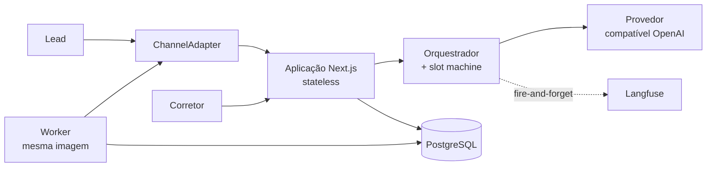

# Agente SDR Imobiliário

POC de um **agente de IA para pré-atendimento e qualificação de leads no mercado
imobiliário brasileiro**. Tech Challenge — Fase 5, FIAP.

> **Status:** projeto em configuração. A stack de execução chega na primeira spec
> do backlog. Ver [Como executar](#como-executar).

---

## O problema

Imobiliárias pagam caro por cada lead — entre R$ 30 e R$ 150, dependendo do canal —
e desperdiçam boa parte deles por três motivos banais:

- **Tempo de resposta.** O lead que chega às 22h de sábado fala com o concorrente
  antes de falar com você.
- **Falta de follow-up.** Quem não responde à primeira mensagem é abandonado.
- **Falta de priorização.** O corretor trata igual quem quer comprar em 30 dias e
  quem está só olhando.

## A solução

Um **SDR digital** que atende em segundos, 24 horas por dia, em conversa natural.
Identifica se o cliente quer comprar, alugar ou investir; coleta orçamento, região,
quartos e urgência; consulta o catálogo e sugere imóveis reais; propõe horários de
visita; e entrega ao corretor um lead já qualificado com resumo pronto. Se o lead
some, o agente volta sozinho — mantendo o contexto da conversa anterior.

O corretor deixa de ser recepcionista e volta a ser vendedor.

**A IA não fecha venda.** Ela protege o tempo do corretor e evita que o lead esfrie.

---

## Arquitetura

Monolito modular: uma aplicação Next.js stateless, com fronteiras internas rígidas
e um worker como processo separado desde o primeiro dia.



| Camada | Escolha |
|---|---|
| Aplicação | Next.js (App Router) + TypeScript `strict` |
| Orquestração do agente | Vercel AI SDK |
| Modelo | Provedor compatível com OpenAI — oMLX local, trocável por endpoint hospedado |
| Banco | PostgreSQL + Drizzle ORM |
| Assíncrono | `followup_jobs` + outbox `events` no próprio Postgres — **sem Redis** |
| Observabilidade | Langfuse |
| Execução | Docker Compose — `app`, `worker`, `db` |

Três propriedades sustentam a escala sem reescrita: a aplicação é **stateless**, o
estado é **externalizado**, e o worker já é **processo separado**. Detalhes e o
caminho de escala em [`docs/arquitetura/visao-geral.md`](docs/arquitetura/visao-geral.md).

---

## Como executar

> **Ainda não disponível.** O `docker-compose.yml` e o `Dockerfile` são entregues
> pelo item 1 do [backlog](specs/BACKLOG.md). Esta seção será preenchida por aquela
> spec.

**Pré-requisitos previstos:**

- Docker e Docker Compose — **única exigência obrigatória**
- [oMLX](https://omlx.ai/) rodando no host, para inferência local em Apple Silicon.
  Não é containerizável; ver
  [restrições de implantação](docs/arquitetura/restricoes-de-implantacao.md).
  Alternativa: qualquer endpoint compatível com OpenAI, configurado por variável de
  ambiente.

A meta é que um desenvolvedor em qualquer sistema operacional clone o repositório e
execute `docker compose up` sem instalar mais nada.

---

## Estrutura do repositório

| Pasta | Conteúdo | Normativo? |
|---|---|---|
| `.specify/memory/constitution.md` | Regras inegociáveis do projeto | **Sim — máxima autoridade** |
| `docs/` | Arquitetura real, decisões e restrições | **Sim** |
| `specs/` | Especificações por funcionalidade | **Sim**, para a funcionalidade que descrevem |
| `reference/` | Material de ideação inicial | **Não** — ver [`reference/README.md`](reference/README.md) |
| `AGENTS.md` | Briefing para agentes de código | Sim |

> ⚠️ `reference/` descreve um desenho anterior em Python que **não será
> construído**. Serve para intenção de produto e narrativa; nunca como requisito
> técnico.

### Documentos principais

- [Visão geral da arquitetura](docs/arquitetura/visao-geral.md) — componentes, estrutura, fluxos e caminho de escala
- [Restrições de implantação](docs/arquitetura/restricoes-de-implantacao.md) — o que não roda em contêiner local, e por quê
- [Decisões técnicas](docs/arquitetura/adr/decisoes.md) — o que foi decidido e com que consequências
- [Decisões pendentes](docs/decisoes-pendentes.md) — o que ainda não foi decidido
- [Backlog](specs/BACKLOG.md) — fatias de trabalho e rastreabilidade com o enunciado

---

## Desenvolvimento orientado a especificação

O projeto é construído por agentes de código (Claude Code, Cursor) conduzidos por um
desenvolvedor. A qualidade da especificação determina a qualidade do resultado mais
do que qualquer prompt isolado — por isso o fluxo é formal:

```
/speckit-specify → /speckit-clarify → /speckit-plan → /speckit-tasks
                 → /speckit-analyze → /speckit-implement
```

Ferramenta: [GitHub Spec Kit](https://github.com/github/spec-kit), instalado para
Claude Code e Cursor. **Nenhum código de produção sem spec aprovada em `specs/`.**

Como não há revisão por pares neste projeto, `/speckit-analyze` é obrigatório antes
de implementar — é o único portão de qualidade automatizado que existe.

---

## Convenções

- **Código, identificadores, comentários e commits em inglês.** Documentação e
  interface em português.
- **Interface e conversa do agente em pt-BR apenas.** Sem framework de i18n.
- Tradução de termos de domínio pelo glossário em [`AGENTS.md`](AGENTS.md) —
  `corretor` vira `broker`, `imóvel` vira `property`, nunca transliteração.
