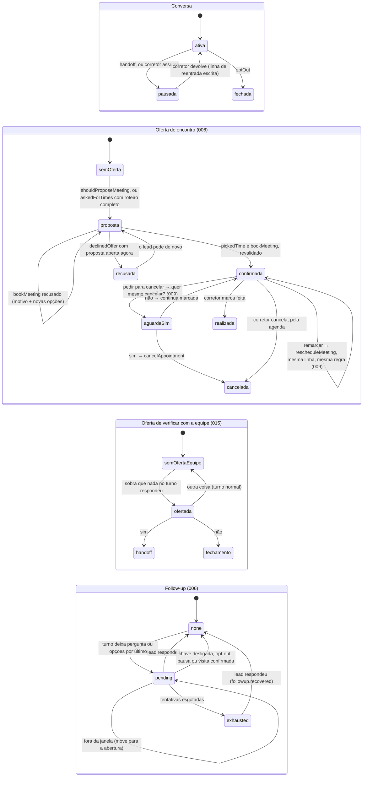

# O turno do agente — quem decide o quê

> Mapa de referência para responder, a qualquer momento: **isto é uma chamada de modelo ou uma conta do código?
> E o que liga isso neste turno?** Reflete o código das specs 004, 005, 007, 006 (propor, reservar, as saídas,
> o botão *Interessado* e o follow-up, marcados *(006)*), 009 (cancelar, remarcar, até três compromissos,
> marcados *(009)*) e 015 (o que a Sofia não resolve: a oferta de verificar com a equipe, marcada *(015)*).

## A regra, em uma frase

**O modelo lê, o código decide, o modelo só age pelas ferramentas que o código oferece, e só fala depois que
tudo foi decidido.** O que precisa ser exato — datas, recusas, avisos — o código escreve.

| Cor | Quem | O que é |
|---|---|---|
| 🟦 | **Código calcula** | Determinístico, testável sem modelo. Decide tudo o que importa. |
| 🟨 | **Modelo lê** | Extração: devolve JSON com slots e fatos. **Sem tools.** Não decide nada. |
| 🟥 | **Modelo age** | *Tool call* dentro do `act()`, só com as tools que o código ofereceu, no máximo 3 passos. O texto dessa chamada é **descartado** — nada dele chega ao lead. |
| 🟪 | **Modelo fala** | `phrase()`: a resposta, em streaming frase a frase, cada frase passando pelas guardas. |
| 🟩 | **Código escreve** | Frase fixa, sem modelo. Usada quando errar não é aceitável. |

## 1 · Um turno, do começo ao fim

```mermaid
flowchart TD
    classDef codigo fill:#dbeafe,stroke:#1d4ed8,color:#0f172a
    classDef le fill:#fef9c3,stroke:#a16207,color:#0f172a
    classDef age fill:#fee2e2,stroke:#b91c1c,color:#0f172a
    classDef fala fill:#ede9fe,stroke:#6d28d9,color:#0f172a
    classDef escrita fill:#dcfce7,stroke:#15803d,color:#0f172a

    IN(["Mensagem do lead<br/>digitada, ou pelo botão Interessado do card (006)"]) --> GATE{"Portão<br/>conversa ativa · consentimento<br/>um turno por vez · debounce"}:::codigo
    GATE -- "não" --> QUIET(["Silêncio<br/>corretor assumiu ou falta consentimento"])
    GATE -- "sim" --> INJ{"looksLikeInjection?"}:::codigo
    INJ -- "sim" --> W_REF["refusalReply"]:::escrita
    INJ -- "não" --> EXT["extract()<br/>slots + fatos da mensagem<br/>015: o ato da mensagem e a sobra"]:::le
    EXT --> FAIL{"extração falhou?"}:::codigo
    FAIL -- "sim" --> W_FAIL["aviso de falha técnica<br/>streak mantém"]:::escrita
    FAIL -- "não" --> LEX["readTurn() — leituras do código<br/>dia e período · sim/não · verbos de mudança<br/>015: só obrigado/ok · escolha de horário · outros imóveis"]:::codigo
    LEX --> MERGE["mergeSlots<br/>filled · revised · intentChanged · dropped"]:::codigo
    MERGE --> REC{"shouldRecover?"}:::codigo
    REC -- "sim" --> RSLOT["recoverSlot()<br/>um slot só"]:::le
    REC -- "não" --> OPT{"optOut?"}:::codigo
    RSLOT --> OPT
    OPT -- "sim" --> W_OPT["OPT_OUT_REPLY"]:::escrita
    OPT -- "não" --> ACC["accountTurn<br/>streak: zera · mantém · avança"]:::codigo
    ACC --> DEC["Decidir<br/>handoffDecision · shouldProposeMeeting<br/>+ offerOutstanding · nextQuestion"]:::codigo
    DEC --> HO{"handoff?<br/>006: não, se a mensagem é sobre o encontro<br/>015: sim à oferta de verificar com a equipe"}:::codigo
    HO -- "sim" --> W_HO["handoffReply"]:::escrita
    HO -- "não" --> MEET["Encontro (006)<br/>formato ou pedido fora do domínio → ainda não consigo (streak avança)<br/>recusa → declineProposal · pedido ou interesse → meetingTarget<br/>visita sem imóvel → pergunta qual · senão proposeAppointment<br/>009: mudar o que foi marcado → decideChange<br/>qual delas? · quer mesmo cancelar? → cancelAppointment · remarcar → opções"]:::codigo
    MEET --> ACTQ{"act() oferecido?<br/>busca devida, sem frase de agenda<br/>006: proposta aberta + pickedTime<br/>009: compromisso a remarcar"}:::codigo
    ACTQ -- "sim" --> ACT["act() — até 3 passos<br/>searchProperties<br/>006: bookMeeting · 009: rescheduleMeeting"]:::age
    ACTQ -- "não" --> AGENDA
    ACT --> AGENDA{"frase de agenda?<br/>opções · confirmação · recusa da reserva"}:::codigo
    AGENDA -- "sim" --> W_MEET["frase escrita pelo código<br/>datas, horários e 'alguém da nossa equipe'"]:::escrita
    AGENDA -- "não" --> FACTS["reconfirmação · último resultado de busca<br/>fatos derivados do Postgres"]:::codigo
    FACTS --> CANT{"tentou algo que não dá para usar<br/>e fez uma pergunta?"}:::codigo
    CANT -- "sim" --> W_CANT["ainda não consigo te ajudar com isso"]:::escrita
    CANT -- "não" --> FRONT{"sobrou pedido, pergunta ou informação<br/>que nada neste turno respondeu?<br/>015: fronteira"}:::codigo
    FRONT -- "sim" --> OFFER["oferta de verificar com a equipe<br/>pendente nos metadados"]:::codigo
    OFFER --> TASK
    FRONT -- "não" --> FECHA{"nada pendente e nada perguntado?<br/>009: fechamento · 015: não à oferta"}:::codigo
    FECHA -- "sim" --> W_FECHA["Fica marcado: … (código)<br/>+ despedida (modelo)"]:::escrita
    W_FECHA --> TASK
    FECHA -- "não" --> TASK["task()<br/>escolhe UMA instrução por precedência<br/>009: depois de um fechamento, retomar com naturalidade<br/>015: a oferta · a despedida"]:::codigo
    TASK --> PHR["phrase()<br/>streaming frase a frase<br/>006: depois de um prefixo escrito, se houver"]:::fala
    PHR --> GRD{"guardas por frase<br/>sintaxe · idioma · valores · nº de perguntas<br/>015: sem a pergunta da oferta, o código a acrescenta"}:::codigo
    GRD -- "reprovou" --> W_FB["fallbackText"]:::escrita
    GRD -- "passou" --> COMMIT
    W_REF & W_FAIL & W_OPT & W_HO & W_MEET & W_CANT & W_FB --> COMMIT["commitTurn<br/>mensagens · slots · eventos<br/>006: opções e reserva nos metadados<br/>006: agenda o follow-up se sobrou pergunta ou opções"]:::codigo
```

**Por que três chamadas de modelo, e não uma.** `extract()` é um contrato JSON estreito, estabilizado a duras
penas no modelo 4-bit; pôr tools nele reintroduz a falha que o commit `7f2ded0` removeu. `phrase()` transmite
frases que **já chegaram à tela**; uma tool no meio dele buscaria depois de ter afirmado o resultado. O `act()`
fica no meio, onde nada foi dito ainda — e só roda quando há algo para fazer.

## 2 · O que fica guardado entre um turno e outro

- **Uma oferta recusada não é oferecida de novo por conta própria** — `offerOutstanding` continua verdadeiro
  porque a mensagem da oferta está no histórico. O lead pode sempre pedir.
- **Sem horário, sem handoff automático** (006): o agente diz que não há horário agora e mantém a proposta anterior aberta; quem quer uma pessoa pede.
- **Uma mensagem sobre o encontro não é pedido de humano** (006): a extração lê *"a segunda"* ou *"quero agendar"*
  como `askedForHuman`, porque o encontro é com uma pessoa. Quando a mesma mensagem escolhe, pede ou recusa
  horários, o código ignora esse fato. E uma escolha vence um pedido de horários na mesma mensagem.
- **Visita só com imóvel; o outro encontro é por telefone** (006): com cards na tela e nenhum apontado, o agente pergunta
  qual imóvel (botão *Interessado* ou código) e oferece o telefone; isso já conta como a oferta, para não repetir.
  Pedido de encontro no escritório, por Meet, Zoom, FaceTime ou outro formato: *"ainda não consigo te ajudar com
  isso"* e o telefone, se nenhum já estiver marcado. Pedido fora do domínio numa visita (carona, reembolso, escolher
  quem atende por uma característica pessoal): só *"ainda não consigo"*. Os dois avançam o streak.
- **Nenhum nome de corretor chega ao modelo por causa da agenda** (006): opções e confirmação dizem *"alguém da
  nossa equipe"*, escritas pelo código; depois de uma devolução, o modelo não confirma nem nega quem atende.
- **Uma proposta aberta não sequestra a conversa**: o lead pode mudar de assunto e voltar a ela depois.
- **O streak de não compreensão** é um número em `conversations.fallbackStreak`: zera quando o turno aprende
  algo, **mantém** em conversa fiada ou falha técnica, **avança** quando o lead tentou algo inutilizável. Em 2,
  handoff.
- **Follow-up**: só a chave da agência (006) e a janela de horário decidem se uma tentativa **devida** sai; o
  agendamento não consulta a chave.

## 3 · Quem faz cada verbo, e o que o liga neste turno

| Verbo | Quem | Onde | Liga quando |
|---|---|---|---|
| botão **Interessado** no card *(006)* | 🟩 widget envia | `app/(public)/chat/…/PropertyCard.tsx` | clique ou toque: posta *"Interessado em VMA-0005"* em nome do lead, como mensagem dele, e um turno normal começa; a resposta depende de onde a conversa está (FR-004d) |
| debounce · `claimTurn` | 🟦 código | `channels/web.ts` · `services/conversation.ts` | toda mensagem; um turno por conversa, depois de `CHAT_DEBOUNCE_MS` de silêncio |
| `looksLikeInjection` | 🟦 código | `domain/injection.ts` | todo turno; três frases fixas de tentativa de manipulação |
| `extract()` | 🟨 modelo lê | `agent/orchestrator.ts` | todo turno que passou do portão. Devolve slots e os fatos `askedForHuman`, `optOut`, `attemptedAnswer`, `askedAboutCriteria`; **006:** `declinedOffer`, `askedForTimes`, `pickedTime`, `preferredWeekday`, `preferredPeriod`, `propertyPosition`, `propertyCode`, `askedWhoAttends`, **009:** `changeRequest`, `answer`, `meetingKind`, `unsupportedMeeting`, `outOfScopeRequest`; **015:** `messageAct` (agradece, concorda, responde, pede, pergunta, informa, outro) e `uncovered` (a sobra: o que nenhum campo registrou) |
| `readTurn` — leituras do código *(009, 015)* | 🟦 código | `agent/read.ts` · `agent/lexicon.ts` | o nó que assenta o que a mensagem diz: tudo o que vem depois decide a partir dele, nunca do texto cru. Todo turno, depois da extração: dia e período (`parseWhen`), sim/não a uma pergunta pendente, verbos de remarcar e cancelar; uma mensagem que é **só** agradecimento ou concordância (*obrigado, valeu, ok, beleza, 👍*) vale como tal, seja lá o que o modelo leu, e não carrega pedido (recusa, humano, opt-out); *"outros imóveis"* / *"mais opções"* é a pergunta sobre os critérios; com horários na mesa, *"a primeira"*, *"2"*, *"opção 3"* é uma escolha. Vocabulário fechado, como o `parseWhen` |
| `boundaryOffer` *(015)* | 🟦 código | `agent/decide/boundary.ts` | a mensagem pede, pergunta ou informa algo que sobrou, **e** o turno não tem nada melhor a dizer (nenhuma frase escrita, busca, critérios, revisão). O modelo escreve a oferta (reconhece, diz que não consegue confirmar, oferece que alguém da equipe verifique); se esquecer a pergunta, o código a acrescenta. A oferta fica pendente (`humanOffer`): **sim** → handoff normal; **não** → fechamento; outra coisa → turno normal. A pergunta do roteiro espera um turno |
| `recoverSlot()` | 🟨 modelo lê | `agent/recovery.ts` | slot pendente ficou vazio, a extração não disse nada dele, **e** o lead tentou responder |
| `mergeSlots` | 🟦 código | `domain/slots.ts` | todo turno; separa preenchido, revisado, intenção trocada e recusado |
| `accountTurn` | 🟦 código | `agent/orchestrator.ts` | todo turno; decide o streak. **006:** um pedido que a imobiliária não atende (encontro no escritório ou por vídeo, carona, escolher quem atende por aparência, cor, gênero, ideologia…) **avança** o streak, mesmo que o turno tenha aprendido algo |
| `handoffDecision` | 🟦 código | `domain/handoff.ts` | lead pediu humano (**006:** numa mensagem que não é sobre o encontro), ou streak chegou a 2 |
| `shouldProposeMeeting` | 🟦 código | `domain/handoff.ts` | roteiro completo (compra/aluguel: quente e com contato; investimento: sempre) **e** nenhuma oferta já feita (`offerOutstanding`) |
| `meetingTarget` *(006)* | 🟦 código | `agent/orchestrator.ts` | antes de propor: investidor → conversa por telefone; pediu telefone → telefone; horários de telefone já na mesa → telefone *(009)*; imóvel em jogo → visita; cards na tela e nenhum apontado → **pergunta qual imóvel** (ou oferece o telefone), sem horários; nada mostrado ainda → telefone |
| `proposeAppointment` *(006)* | 🟦 código | `services/scheduling.ts` | `shouldProposeMeeting`, **ou** `askedForTimes`/interesse com roteiro completo (incompleto: *"Assim que eu tiver seus dados…"*, uma vez; já agendado: *"ainda não consigo"*). Dia e período pedidos filtram **antes** do limite de três. Datas e horários são escritos pelo código |
| `resolvePropertyRef` *(006)* | 🟦 código | `services/conversation.ts` | a extração trouxe `propertyRef` (*"o segundo"*, *"VMA-0005"*); resolve só contra imóveis **já mostrados nesta conversa**, nunca adivinha |
| `declineProposal` *(006)* | 🟦 código | `services/scheduling.ts` | `declinedOffer` **com proposta aberta agora** — uma linha ainda `proposed` (`turn.proposalOpen`), não "já houve oferta" (`appointmentProposed`, que só evita repetir a oferta). Depois de uma reserva, *"não vou mais poder"* não é recusa: é pedido de cancelamento (009) |
| `parseWhen` *(009)* | 🟦 código | `agent/meeting-change.ts`, chamado por `readTurn` | todo turno: lê do texto os dias da semana, *manhã/tarde* e *hoje/amanhã/depois de amanhã* (relativos à data de hoje) e completa o que o modelo extraiu — o que o código acha vale mais. Com horários na mesa, um dia ou período sozinho (*"nada na quarta?"*) pede outras opções da proposta, a não ser que a mensagem diga para remarcar ou cancelar |
| fechamento *(009, 015)* | 🟪 modelo, com os fatos do código | `chooseTask` `closing` · `describeMeeting` | nada pendente, nenhuma pergunta, nada aprendido, nenhuma sobra, e já houve oferta ou há compromisso — ou um **não** à oferta de verificar com a equipe. O código passa o que está marcado; o modelo lembra isso e se despede, sem pergunta (a guarda de saída descarta uma). Um segundo fechamento seguido é só a despedida. A mensagem seguinte do lead é uma retomada: o modelo cumprimenta com naturalidade antes de seguir |
| o que a Sofia pode *(015)* | 🟦 prompt fixo | `agent/prompts/system.ts` `CAPABILITIES` | todo `phrase()`: buscar, marcar/remarcar/cancelar, explicar os critérios; o que **não** consegue garantir (acompanhantes, animais, desconto, financiamento, condomínio…); nunca anunciar uma ação fora da lista. Fica na parte constante do prompt, que o cache guarda. Desconto deixou de ser recusa: vira oferta |
| `decideChange` *(009)* | 🟦 código | `agent/orchestrator.ts` · `agent/meeting-change.ts` | `changeRequest` (cancelar/remarcar), um `answer` sim/não à pergunta anterior, ou a resposta a *"qual delas?"* — lida contra os compromissos listados (`matchAnswer`). Cancelar só depois do sim (`cancelAppointment`); remarcar vai ao `act()` e, sem horário dito, oferece horários daquele compromisso; depois de cancelar, um sim a *"quer marcar outro dia?"* oferece de novo. Até **três** compromissos futuros por lead |
| `rescheduleMeeting` *(009)* | 🟥 tool | `agent/tools/reschedule-meeting.ts` | dentro do `act()`, quando o lead está remarcando. Move **a mesma linha** e revalida com o mesmo `checkSlot` da marcação, ignorando só o horário do próprio compromisso. O briefing traz os próximos sete dias já calculados, para "segunda" nunca virar uma segunda que passou |
| pergunta sobre o que está marcado *(015)* | 🟪 modelo, com o estado | `askedAboutMeetings` · `chooseTask` `meetings.status` | *"a visita continua de pé?"*: o estado da frase traz os compromissos marcados (sempre que houver) e o modelo responde só com eles, sem pergunta. Sem nada marcado: *"Não tenho nenhuma visita ou conversa marcada…"* |
| quem vai atender *(006, 015)* | 🟩 código | `ATTENDEE_UNKNOWN_SENTENCE` | *"Daqui eu só consigo ver o dia, o horário, o tipo e o imóvel…; quem vai te atender, só os corretores conseguem confirmar. Quer que eu chame um corretor…?"* — a oferta fica pendente como a da fronteira; sim → handoff |
| `nextQuestion` | 🟦 código | `domain/slots.ts` | quando não há oferta nem handoff no turno — **quem escolhe a próxima pergunta é sempre o código** |
| `act()` | 🟥 modelo age | `agent/act.ts` | critério de busca preenchido ou revisado com o roteiro qualificado; **006:** ou proposta aberta **e** `pickedTime` sem recusa |
| `searchProperties` | 🟥 tool | `agent/tools/search-properties.ts` | dentro do `act()`. Agência e a recusa para investidor vêm do código, nunca do argumento. **006 FR-020:** uma área pedida casa com o bairro **ou a região** (*"zona norte"* acha Santana) |
| `bookMeeting` *(006)* | 🟥 tool | `agent/tools/book-meeting.ts` | dentro do `act()`. Revalida pelo mesmo cálculo que gerou as opções |
| reconfirmação | 🟦 código | `domain/revision.ts` | slot já preenchido foi revisado, tem dependentes, o turno anterior não foi reconfirmação, **e nenhuma busca apareceu neste turno** |
| `lastSearchOutcome` | 🟦 código | `services/conversation.ts` | turnos sem busca; é a última busca lida das mensagens gravadas |
| `task()` | 🟦 código | `agent/prompts/system.ts` · `replyKind` em `agent/orchestrator.ts` | escolhe **uma** instrução. Ordem (006, FR-005g): confirmação › opções › resultado de busca › pergunta sobre critérios ou resultados › reconfirmação › pergunta do roteiro. As duas primeiras são frases escritas e nem chegam ao `task()`; a aceitação de uma recusa vem **antes** do vencedor, como prefixo, e só suprime opções e reconfirmação |
| `phrase()` | 🟪 modelo fala | `agent/orchestrator.ts` | sempre que o turno não terminou numa frase escrita |
| guardas | 🟦 código | `domain/reply-guards.ts` | cada frase: sintaxe vazada, idioma, valor sem lastro, número de perguntas |
| frases escritas | 🟩 código | `agent/prompts/fallback.ts` · `services/handoff.ts` · `agent/prompts/meeting.ts` | recusa, falha técnica, opt-out, handoff, *"ainda não consigo"*, reentrada; **006:** opções, confirmação, motivo de uma reserva recusada, recusa aceita, *"assim que eu tiver seus dados"*, e *"ainda não consigo te dizer o nome de quem vai te atender"* quando há proposta ou visita |
| card do encontro *(006)* | 🟩 widget | `app/(public)/chat/…/MeetingCard.tsx` | mensagem com `booking` nos metadados: dia, hora, tipo e — numa visita — o código do imóvel; nunca o corretor |
| `commitTurn` | 🟦 código | `services/conversation.ts` | fim de todo turno; **006:** grava `meetingOptions`, `offerDeclined`, `interestedProperty` e `booking` nos metadados da resposta, e agenda o follow-up (`scheduleFollowup`) se sobrou pergunta do roteiro ou opções |
| `cancelFollowup` *(006)* | 🟦 código | `services/followup.ts` · chamado por `recordLeadMessage` | toda mensagem do lead: cancela tentativas pendentes, zera contagem e estado; se um follow-up já tinha saído, `followup.recovered` uma vez |
| varredura de follow-up *(006)* | 🟦 código + 🟪 modelo escreve | `jobs/followup.ts` · `agent/followup-writer.ts` | worker, a cada varredura; claim com `SKIP LOCKED`; elegibilidade checada duas vezes (depois do claim e antes do envio), incluindo a chave da agência; o modelo escreve só a frase de abertura, conferida (sem pergunta, data, hora ou nome da equipe) e trocada por uma escrita pelo código se reprovar; a pergunta pendente é do código |

## Ver também

- [`visao-geral.md`](visao-geral.md) §5 (fluxos) e §9 (defesas contra manipulação)
- [ADR 22](adr/decisoes.md#22-revisable-qualification-state-and-actions-as-tool-calls) — por que ações viraram tools e o estado ficou revisável
- Spec 007 — [`contracts/observability.md`](../../specs/007-revisable-orchestration/contracts/observability.md): como cada passo aparece no Langfuse
