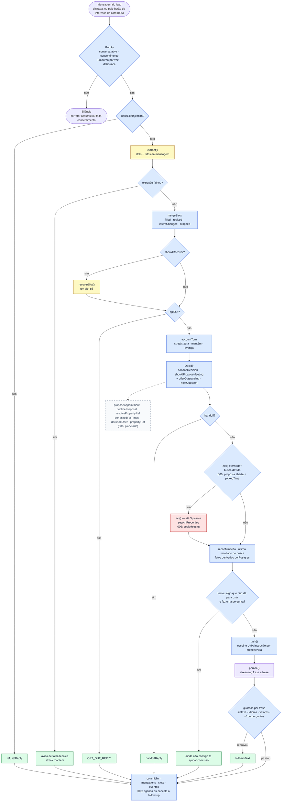
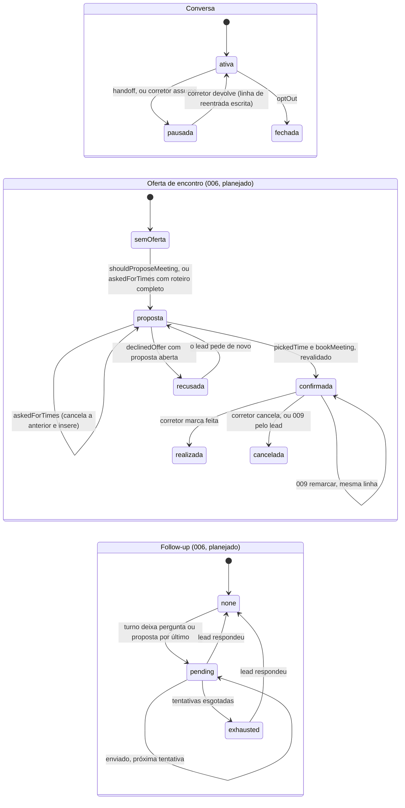

# O turno do agente — quem decide o quê

> Mapa de referência para responder, a qualquer momento: **isto é uma chamada de modelo ou uma conta do código?
> E o que liga isso neste turno?** Reflete o código das specs 004, 005 e 007. O que a **spec 006** acrescenta
> aparece **tracejado** e marcado *(006, planejado)* — atualizar quando ela for implementada (tarefa T039a).

## A regra, em uma frase

**O modelo lê, o código decide, o modelo só age pelas ferramentas que o código oferece, e só fala depois que
tudo foi decidido.** O que precisa ser exato — datas, recusas, avisos — o código escreve.

| Cor | Quem | O que é |
|---|---|---|
| 🟦 | **Código calcula** | Determinístico, testável sem modelo. Decide tudo o que importa. |
| 🟨 | **Modelo lê** | Extração: devolve JSON com slots e fatos. **Sem tools.** Não decide nada. |
| 🟥 | **Modelo age** | *Tool call* dentro do `act()`, só com as tools que o código ofereceu, no máximo 3 passos. O texto dessa chamada é **descartado** — nada dele chega ao lead. |
| 🟪 | **Modelo fala** | `phrase()`: a resposta, em streaming frase a frase, cada frase passando pelas guardas. |
| 🟩 | **Código escreve** | Frase fixa, sem modelo. Usada quando errar não é aceitável. |

## 1 · Um turno, do começo ao fim

**Por que três chamadas de modelo, e não uma.** `extract()` é um contrato JSON estreito, estabilizado a duras
penas no modelo 4-bit; pôr tools nele reintroduz a falha que o commit `7f2ded0` removeu. `phrase()` transmite
frases que **já chegaram à tela**; uma tool no meio dele buscaria depois de ter afirmado o resultado. O `act()`
fica no meio, onde nada foi dito ainda — e só roda quando há algo para fazer.

## 2 · O que fica guardado entre um turno e outro

- **Uma oferta recusada não é oferecida de novo por conta própria** — `offerOutstanding` continua verdadeiro
  porque a mensagem da oferta está no histórico. O lead pode sempre pedir.
- **Sem horário, sem handoff automático** (006): o agente diz que não há horário agora e mantém a proposta anterior aberta; quem quer uma pessoa pede.
- **Uma proposta aberta não sequestra a conversa**: o lead pode mudar de assunto e voltar a ela depois.
- **O streak de não compreensão** é um número em `conversations.fallbackStreak`: zera quando o turno aprende
  algo, **mantém** em conversa fiada ou falha técnica, **avança** quando o lead tentou algo inutilizável. Em 2,
  handoff.
- **Follow-up**: só a chave da agência (006) e a janela de horário decidem se uma tentativa **devida** sai; o
  agendamento não consulta a chave.

## 3 · Quem faz cada verbo, e o que o liga neste turno

| Verbo | Quem | Onde | Liga quando |
|---|---|---|---|
| botão de interesse no card *(006)* | 🟩 widget envia | `app/(public)/chat/…/PropertyCard.tsx` | clique ou toque no card: envia *"Tenho interesse no VMA-0005"* como mensagem do lead, e um turno normal começa |
| debounce · `claimTurn` | 🟦 código | `channels/web.ts` · `services/conversation.ts` | toda mensagem; um turno por conversa, depois de `CHAT_DEBOUNCE_MS` de silêncio |
| `looksLikeInjection` | 🟦 código | `domain/injection.ts` | todo turno; três frases fixas de tentativa de manipulação |
| `extract()` | 🟨 modelo lê | `agent/orchestrator.ts` | todo turno que passou do portão. Devolve slots e os fatos `askedForHuman`, `optOut`, `attemptedAnswer`, `askedAboutCriteria`; **006:** `declinedOffer`, `askedForTimes`, `pickedTime`, `timePreference`, `propertyRef` |
| `recoverSlot()` | 🟨 modelo lê | `agent/recovery.ts` | slot pendente ficou vazio, a extração não disse nada dele, **e** o lead tentou responder |
| `mergeSlots` | 🟦 código | `domain/slots.ts` | todo turno; separa preenchido, revisado, intenção trocada e recusado |
| `accountTurn` | 🟦 código | `agent/orchestrator.ts` | todo turno; decide o streak |
| `handoffDecision` | 🟦 código | `domain/handoff.ts` | lead pediu humano, ou streak chegou a 2 |
| `shouldProposeMeeting` | 🟦 código | `domain/handoff.ts` | roteiro completo (compra/aluguel: quente e com contato; investimento: sempre) **e** nenhuma oferta já feita (`offerOutstanding`) |
| `proposeAppointment` *(006)* | 🟦 código | `services/scheduling.ts` | `shouldProposeMeeting`, **ou** `askedForTimes` com roteiro completo. Datas e horários são escritos pelo código |
| `resolvePropertyRef` *(006)* | 🟦 código | `services/conversation.ts` | a extração trouxe `propertyRef` (*"o segundo"*, *"VMA-0005"*); resolve só contra imóveis **já mostrados nesta conversa**, nunca adivinha |
| `declineProposal` *(006)* | 🟦 código | `services/scheduling.ts` | `declinedOffer` **com proposta aberta** |
| `nextQuestion` | 🟦 código | `domain/slots.ts` | quando não há oferta nem handoff no turno — **quem escolhe a próxima pergunta é sempre o código** |
| `act()` | 🟥 modelo age | `agent/act.ts` | critério de busca preenchido ou revisado com o roteiro qualificado; **006:** ou proposta aberta **e** `pickedTime` sem recusa |
| `searchProperties` | 🟥 tool | `agent/tools/search-properties.ts` | dentro do `act()`. Agência e a recusa para investidor vêm do código, nunca do argumento |
| `bookMeeting` *(006)* | 🟥 tool | `agent/tools/book-meeting.ts` | dentro do `act()`. Revalida pelo mesmo cálculo que gerou as opções |
| reconfirmação | 🟦 código | `domain/revision.ts` | slot já preenchido foi revisado, tem dependentes, o turno anterior não foi reconfirmação, **e nenhuma busca apareceu neste turno** |
| `lastSearchOutcome` | 🟦 código | `services/conversation.ts` | turnos sem busca; é a última busca lida das mensagens gravadas |
| `task()` | 🟦 código | `agent/prompts/system.ts` | escolhe **uma** instrução: cards › sem resultado › pergunta sobre critérios ou resultados › reconfirmação › oferta › pergunta do roteiro |
| `phrase()` | 🟪 modelo fala | `agent/orchestrator.ts` | sempre que o turno não terminou numa frase escrita |
| guardas | 🟦 código | `domain/reply-guards.ts` | cada frase: sintaxe vazada, idioma, valor sem lastro, número de perguntas |
| frases escritas | 🟩 código | `agent/prompts/fallback.ts` · `services/handoff.ts` | recusa, falha técnica, opt-out, handoff, *"ainda não consigo"*, reentrada; **006:** opções, confirmação, recusa aceita |
| `commitTurn` | 🟦 código | `services/conversation.ts` | fim de todo turno; **006:** agenda o follow-up se sobrou pergunta ou proposta, cancela a cada mensagem do lead |
| varredura de follow-up *(006)* | 🟦 código + 🟪 modelo escreve | `jobs/followup.ts` · `agent/followup-writer.ts` | worker; elegibilidade checada duas vezes, incluindo a chave da agência |

## Ver também

- [`visao-geral.md`](visao-geral.md) §5 (fluxos) e §9 (defesas contra manipulação)
- [ADR 22](adr/decisoes.md#22-revisable-qualification-state-and-actions-as-tool-calls) — por que ações viraram tools e o estado ficou revisável
- Spec 007 — [`contracts/observability.md`](../../specs/007-revisable-orchestration/contracts/observability.md): como cada passo aparece no Langfuse
