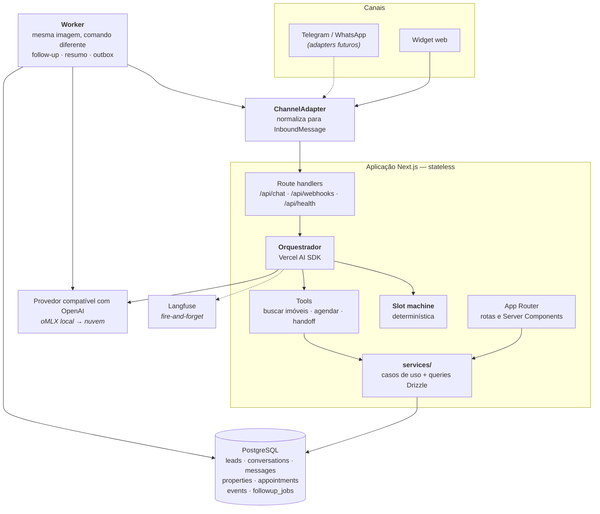

# Arquitetura — visão geral

Documento normativo. Descreve a arquitetura **real** da solução, para a stack
efetivamente escolhida. A pasta `reference/` descreve um desenho anterior em
Python e não vale como requisito técnico.

---

## 1. Decisão central: monolito modular

Microsserviços em uma POC custam tempo de orquestração e entregam zero valor de
demonstração. Monolito desorganizado, por outro lado, não escala.

A saída é um **monolito modular**: uma única aplicação Next.js, com fronteiras
internas rígidas e um **worker como processo separado desde o primeiro dia**.

Três propriedades sustentam a escala sem reescrita:

1. **Aplicação stateless** — nenhum estado em memória de processo. Escalar
   horizontalmente é aumentar réplicas.
2. **Estado externalizado** — o Postgres é serviço externo, não processo filho.
3. **Trabalho assíncrono desacoplado** — o worker já é um processo separado, com a
   mesma imagem e comando diferente. Extraí-lo para outro serviço depois é mudar
   deploy, não código.

## 2. Diagrama de componentes



O **ChannelAdapter** é a fronteira que protege o resto do sistema do canal. Cada
canal implementa a mesma interface; trocar ou acrescentar canal não toca em
nenhuma outra camada. É o ponto que sustenta o argumento de escalabilidade.

## 3. Estrutura do projeto

```
src/
├── app/              # App Router — apenas rotas, finas
│   ├── (public)/chat/          # widget do lead
│   ├── (app)/leads/            # painel + ficha (drawer)
│   ├── (app)/agenda/
│   ├── (app)/catalogo/
│   ├── login/
│   └── api/{webhooks/[channel],chat,health}/
├── channels/         # interface ChannelAdapter + adapter web
├── agent/            # orchestrator (stateless) · slots · prompts · tools · provider
├── domain/           # entidades e regras puras, sem I/O
├── services/         # casos de uso + queries Drizzle — ÚNICA porta para UI e API
├── db/               # schema · migrations · seed
├── jobs/             # interface JobQueue · followup · summarize · outbox
├── worker/           # entrypoint do worker
└── core/             # config · logging · langfuse · auth · security
```

**Regra de dependência:** `app → services → db`, `agent → services`, e `domain` não
importa nada. É o que permite testar a lógica de qualificação sem subir banco.

Duas consequências que valem ser explícitas:

- **Não existe camada `repositories/`.** Com Drizzle, um repositório seria uma
  função que executa uma query — camada sem comportamento próprio. Os serviços são
  donos das próprias queries.
- **A UI nunca importa `db/`.** Server Components e Server Actions chamam
  `services/`, exatamente como os route handlers fazem. A fronteira é o serviço,
  não o HTTP.

## 4. Trabalho assíncrono

Sem Redis. O Postgres é fila e outbox ao mesmo tempo:

- `followup_jobs` — tentativas de reengajamento agendadas
- `events` — trilha append-only, que serve simultaneamente de auditoria, fonte das
  métricas do painel, linha do tempo da ficha do lead e outbox para integrações

O worker faz polling com `SELECT ... FOR UPDATE SKIP LOCKED`, o que permite mais de
uma réplica sem processamento duplicado. Todo enfileiramento passa pela interface
`JobQueue`, de modo que migrar para SQS ou BullMQ altera uma implementação e mais
nada.

## 5. Fluxos

**Síncrono — mensagem do lead**

1. Canal → route handler → `ChannelAdapter` normaliza
2. Carrega conversa e slots do Postgres
3. Slot machine determina o que ainda falta perguntar
4. Orquestrador monta o contexto e chama o modelo (pode invocar tool)
5. Executa a tool, se houver, e repete
6. Persiste mensagem, atualiza slots, emite evento
7. Adapter envia a resposta
8. Enfileira resumo e próxima janela de follow-up

**Assíncrono — follow-up**

1. Worker acorda em intervalo fixo
2. Busca jobs elegíveis: sem resposta há mais de N horas, conversa ativa,
   tentativas abaixo do limite, dentro da janela permitida, sem `doNotContact`
3. Gera a mensagem a partir do **resumo**, não da transcrição inteira
4. Envia pelo adapter, registra a tentativa e emite evento

## 6. Deploy e caminho de escala

**Local** — um `docker compose up` sobe `app`, `worker` e `db`. É isso que torna a
demonstração confiável em qualquer máquina.

**Nuvem** — os mesmos contêineres em qualquer runtime gerenciado, com Postgres
gerenciado. Aplicação e worker escalam de forma independente.

| Pressão | Ação | Toca o código? |
|---|---|---|
| Mais conversas simultâneas | Réplicas da aplicação | Não — ela é stateless |
| Follow-ups atrasando | Réplicas do worker | Não — `SKIP LOCKED` já protege |
| Volume de fila insuficiente | Trocar por SQS / Pub-Sub | Só a implementação de `JobQueue` |
| Banco saturado | Read replica + pool | Não |
| RAG entra em cena | `CREATE EXTENSION vector` no mesmo Postgres | Módulo novo, nada existente |
| Novo canal (WhatsApp, Telegram) | Nova implementação de `ChannelAdapter` | Uma classe |
| Trocar de modelo ou provedor | `PROVIDER_BASE_URL` + `MODEL_ID` | Nenhuma linha |
| Multiagentes | Roteador antes do orquestrador | Camada nova, orquestrador intacto |
| Voice AI | Middleware de STT no adapter | Orquestrador intacto |

O argumento de arquitetura é este: **cada diferencial do enunciado tem um ponto de
encaixe já previsto no desenho.** Não construímos tudo — construímos o lugar de
tudo.

## 7. Práticas que sustentam a escala

- **12-factor** — toda configuração por variável de ambiente, logs em stdout
- **Logs estruturados em JSON** com `leadId` e `conversationId` em todo registro
- **Idempotência nos webhooks** — o canal reenvia, e o sistema não responde duas vezes
- **Timeout e retry no modelo**, com mensagem de fallback: a conversa nunca morre
- **Rate limit por sessão**, contra abuso e custo descontrolado
- **Migrations versionadas** desde o primeiro commit
- **Health check** em ambos os processos — exigência de qualquer orquestrador de contêiner

## 8. Tempo real: SSE sobre `LISTEN/NOTIFY`

Sem polling e sem WebSocket. O navegador abre **uma** requisição HTTP que o
servidor mantém aberta e na qual escreve eventos JSON — *Server-Sent Events*,
nativo nos navegadores via `EventSource`. O widget assina os eventos da própria
conversa; o painel assina os eventos da agência.

Do lado do servidor, o Postgres faz o pub/sub: toda transação que grava uma
mensagem (agente, corretor, worker) termina com `NOTIFY` carregando **apenas
ids**. Cada réplica da aplicação mantém **uma** conexão dedicada em `LISTEN` e um
mapa em memória de streams abertos por conversa. Ao receber a notificação, a
réplica relê a mensagem **escopada por agência e conversa** e a escreve nos
streams correspondentes. O navegador nunca vê o banco; a chave do stream vem da
sessão assinada, nunca de um id enviado pelo cliente.

**Conexão perdida e redeploy.** Pulso a cada `SSE_PULSE_INTERVAL_MS`; dois pulsos
perdidos e o widget mostra "Conexão perdida. Reconectando…" e bloqueia o envio.
No `SIGTERM` o servidor envia um evento `goodbye` e fecha os streams, então os
clientes reconectam imediatamente. `EventSource` reconecta sozinho com o último
id visto, e o servidor **reenvia do banco** o que faltou. O banco é a verdade; a
notificação é só um despertador.

**Escala, com honestidade.** Uma conexão de `LISTEN` por réplica, não por
cliente — é isso que permite escalar horizontalmente. Limites: notificações não
são duráveis (a releitura na reconexão cobre); `NOTIFY` chega a todas as
réplicas, independente do tenant, e com milhares de agências e muitas réplicas
esse custo cresce — a troca é Redis ou um pub/sub gerenciado atrás da interface
`Notifier`, um módulo. Plataformas serverless derrubam conexões longas; por isso
rodamos em contêineres, com o timeout ocioso do balanceador acima do pulso.

## 9. Segurança do agente contra manipulação

Três camadas, todas em código, nenhuma dependente do prompt obedecer:

1. **Estrutural.** O modelo não decide nada consequente: slots passam por schema,
   a próxima pergunta vem do código, preços só vêm da busca no catálogo, e as
   tools só buscam, propõem horário, pedem corretor ou registram opt-out.
2. **Entrada.** Texto do lead entra sempre como mensagem de usuário, nunca perto
   do system prompt. Uma lista curta de padrões ("ignore suas instruções",
   "system prompt", "você agora é") dispara a recusa padrão sem chamar o modelo.
3. **Saída.** Resposta que vaze instruções, sintaxe de tool, valor em reais ou
   percentual que nenhuma busca retornou, ou que saia do português, é retida e
   substituída antes de chegar ao lead.

A spec 004 mantém cinco tentativas roteirizadas de injeção como teste de que as
três camadas seguram. Abuso de volume é tratado por orçamento de mensagens por
sessão em janela de 30 minutos e por um turno por conversa (ver
[`modelo-de-dados.md`](modelo-de-dados.md) §7).

## Ver também

- [`restricoes-de-implantacao.md`](restricoes-de-implantacao.md) — o que não roda em contêiner local, e por quê
- [`adr/decisoes.md`](adr/decisoes.md) — as decisões técnicas e suas consequências
- [`../decisoes-pendentes.md`](../decisoes-pendentes.md) — o que ainda não foi decidido
- [`configuracoes.md`](configuracoes.md) — registro das configurações que um dia viram painel de administração
