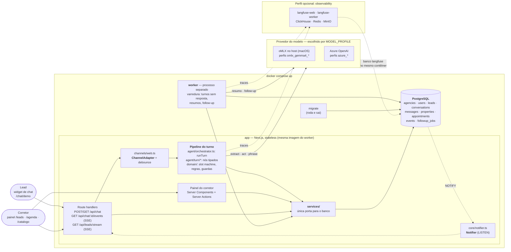
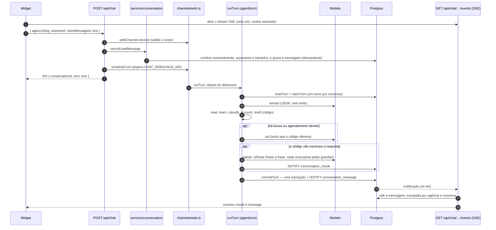

# Arquitetura — visão geral

Descreve a arquitetura **real** da solução, como está no código na entrega
(08/10/2026). A pasta `reference/` descreve um desenho anterior em Python e não
vale como requisito técnico. Onde algo foi desenhado e não construído, o texto
diz *não implementado*.

Documentos vizinhos: o caminho de **uma mensagem dentro do agente** está em
[`turno-do-agente.md`](turno-do-agente.md); as tabelas, em
[`modelo-de-dados.md`](modelo-de-dados.md); o que não roda em contêiner, em
[`restricoes-de-implantacao.md`](restricoes-de-implantacao.md).

---

## 1. Diagrama de componentes

O que o `docker compose up` sobe (`app`, `worker`, `db`, mais um `migrate` que
roda uma vez e sai) e o que fica de fora dele.



Leitura do diagrama:

- **Um modelo, atrás de um perfil.** `agent/provider.ts` é o único módulo que
  importa o SDK de provedor. Trocar de modelo é trocar `MODEL_PROFILE` no `.env`
  (um YAML em `config/models/`, ADR 23). Perfis: `omlx_gemma4_e4b`,
  `omlx_gemma4_e4b_thinking`, `omlx_gemma4_12b`, `azure_nano`, `azure_luna_none`.
- **O modelo faz três coisas no turno** — `extract`, `act` e `phrase` — e duas
  fora dele, no worker: resumo para o corretor e mensagem de follow-up. Quem decide
  o que perguntar, quando propor visita e quando passar para um corretor é código.
- **Langfuse é opcional.** Só sobe com `docker compose --profile observability up`. Uma chamada ao modelo que falha fica
  marcada como `ERROR` (a geração, se a chamada lançou erro; um evento `<nome>.failed`, se a resposta veio mas
  não serviu), então um nó que tentou duas vezes aparece com a tentativa falha ao lado da que valeu.
  Redis, ClickHouse e MinIO existem **só para ele**; a aplicação não usa Redis. Sem
  as chaves `LANGFUSE_*`, o app e o worker rodam idênticos, sem traces.
- **Um único canal implementado: o widget web.** O tipo `Channel` reserva o valor
  `"telegram"`, mas não há adapter nem rota de webhook (ver §6).

## 2. Uma mensagem do lead, de ponta a ponta



Passos que valem nota:

- O `POST` **grava e responde 202**; nunca roda o turno dentro da requisição. A
  resposta chega pelo SSE, que é outra conexão — por isso sobrevive à aba fechada.
- O debounce (`scheduleTurn`) vive na memória do processo; é só agendamento. Se
  o processo morrer com um timer pendente, a mensagem já está no banco e o worker
  (`jobs/unanswered-turns.ts`) refaz exatamente o mesmo turno.
- Os nós do pipeline estão em `agent/turn/run.ts`, na ordem de precedência: quem
  responde o lead encerra o turno. O mapa de quem é modelo e quem é código está em
  [`turno-do-agente.md`](turno-do-agente.md).
- Nada sobrevive entre turnos a não ser linhas no banco; o turno falho antes do
  `commit` devolve o claim e a próxima varredura responde.

## 3. Decisão central: monolito modular

Microsserviços em uma POC custam tempo de orquestração e entregam zero valor de
demonstração. Monolito desorganizado, por outro lado, não escala. A saída é um
**monolito modular**: uma aplicação Next.js com fronteiras internas e um **worker
como processo separado desde o primeiro dia** (ADR 2).

## 4. Os três critérios de avaliação, com honestidade

### Organização da solução

**Verdade hoje**

- Camadas com regra de dependência (§5). Duas são verificadas por lint
  (`eslint.config.mjs`): `src/app/**` não importa `db/`, `drizzle-orm` nem `pg`; e
  `src/domain/**` não importa nada do projeto. As demais valem por convenção.
- O turno do agente é um pipeline de nós tipados, um arquivo por responsabilidade
  em `src/agent/turn/` (a refatoração `refactor-turn` quebrou um orquestrador de
  cerca de 2000 linhas); `services/conversation.ts` é uma fachada sobre um módulo
  por tarefa em `services/conversation/`.
- Decisões registradas: 23 ADRs em [`adr/decisoes.md`](adr/decisoes.md), uma
  constituição em `.specify/memory/constitution.md` e specs em `specs/`.
- Três níveis de teste: unitários e de turno com **modelo roteirizado**
  (`tests/support/scripted-model.ts`, determinísticos), integração contra Postgres
  real (`npm run test:integration`) e checagens com modelo real (`npm run eval`).

**Não feito:** não há CI; o `next build` e o lint rodam à mão.

### Escalabilidade

**Verdade hoje**

- **Aplicação sem estado de negócio.** Cada turno carrega tudo do banco e grava
  tudo de volta numa transação (`commitTurn`). Duas coisas moram na memória do
  processo, de propósito, e ambas são recuperáveis: o timer de debounce (coberto
  pelo worker, §2) e o mapa de streams SSE abertos (reconstruído pelos clientes ao
  reconectar, com `Last-Event-ID`).
- **Estado no Postgres**, serviço externo, com `agency_id` em tudo desde a
  primeira migration (multi-tenant, ADR 10).
- **Worker como processo separado**, com a mesma imagem e outro comando. As
  varreduras de follow-up e de resumo reivindicam linhas com
  `FOR UPDATE SKIP LOCKED`, então mais de um worker não duplica trabalho; um teste
  de integração varre 100 tentativas com dois claimers (`tests/followup-claim.test.ts`).
  O turno em si é protegido por `claimTurn`, uma coluna na própria conversa.
- **Tempo real sem polling**: `LISTEN/NOTIFY` com **uma conexão por réplica**, não
  por cliente (§8).
- **Custo do modelo por turno**: os prompts são montados para o cache de prefixo do servidor (system prompt
  constante, o que muda no fim). Nas conversas de exemplo, 68% a 87% dos *tokens* de entrada vieram do cache.
  Ver [turno do agente §5](turno-do-agente.md#5--o-cache-de-prefixo-o-que-muda-fica-no-fim).

**Não feito**

- **Deploy em nuvem.** Não há. O `docker compose up` roda uma réplica de cada
  serviço e, no momento, com o alvo `dev` do `Dockerfile` (servidor de
  desenvolvimento do Next com bind mount). O alvo `runner`, de produção, existe
  e não é usado pelo compose.
- **Teste de carga e de múltiplas réplicas da aplicação.** A propriedade
  "escalar é subir réplicas" decorre do desenho e dos testes de claim, não de uma
  medição.
- **Limites conhecidos do desenho**: `NOTIFY` chega a todas as réplicas (§8);
  a varredura do worker é por polling de intervalo fixo.

### Componentização

**Verdade hoje: pontos de troca que existem no código**

| Ponto de troca | Onde | Implementações hoje | Para acrescentar outra |
|---|---|---|---|
| Canal | `ChannelAdapter` em `channels/types.ts` | `web` | uma classe nova (`receive` + `send`) e a rota do seu transporte |
| Modelo | `agent/provider.ts` + `config/models/*.yaml` | 5 perfis (oMLX local, Azure) | um YAML novo; nenhuma linha de código |
| Pub/sub do tempo real | interface `Notifier` em `core/notifier.ts` | Postgres `LISTEN/NOTIFY` | um módulo, por exemplo sobre Redis |
| Trabalho do worker | `SweepConsumer` em `jobs/consumers.ts` | `unanswered-turns`, `summarize`, `followup` | um item no array `consumers` |
| Ferramentas do modelo | `agent/tools/index.ts` | busca de imóveis, agendar, remarcar | um arquivo e uma entrada no registro |
| Etapas do turno | `agent/turn/*.ts` | `extract`, `read`, `learn`, `classify`, `account`, `draft`, `act`, `end`, `speak` | um nó com entrada e saída tipadas |

**Não feito**

- **WhatsApp e Telegram não foram implementados.** O que existe é a interface e o
  valor `"telegram"` no tipo `Channel`. A investigação de 27/09 concluiu que o
  WhatsApp (API oficial, número de teste) seria viável em cerca de 1,5 dia; ficou
  abaixo da linha de corte. Ver [`restricoes-de-implantacao.md`](restricoes-de-implantacao.md) §5 e §6.
- **Não existe uma interface `JobQueue`.** Versões anteriores deste documento a
  descreviam. A fila real é o registro de consumidores do worker sobre as tabelas
  `followup_jobs` e `events`; trocar por SQS ou BullMQ seria reescrever esses
  consumidores, não trocar uma implementação.
- **Sem RAG, sem agente especialista, sem voz.** As specs 008 e 010 a 014 foram
  cortadas; nada disso está no código.

## 5. Estrutura do projeto

```
src/
├── app/              # Next.js App Router — rotas finas, sem acesso ao banco
│   ├── (public)/chat/[agencySlug]/   # widget do lead (ChatWidget, cards de imóvel e de visita)
│   ├── (app)/leads/                  # painel e ficha do lead (drawer, transcrição, linha do tempo)
│   ├── (app)/agenda/                 # visitas confirmadas por corretor
│   ├── (app)/catalogo/               # imóveis, com filtros
│   ├── login/
│   └── api/{chat, chat/[conversationId]/events, chat/properties, leads/stream, health, health/ready}
├── channels/         # interface ChannelAdapter, adapter web e o debounce do turno
├── agent/            # orchestrator.ts (só runTurn) · turn/ (pipeline) · prompts/ · tools/
│                     # provider.ts · summarizer.ts · followup-writer.ts · recovery.ts
├── domain/           # regras puras, sem I/O: slots, score, handoff, scheduling, guardas, injeção
├── services/         # casos de uso e queries Drizzle — ÚNICA porta para o banco
│   └── conversation/ # um módulo por tarefa (load, claim, inbound, commit, outbound, history, state)
├── db/               # schema · migrations · seed · client · migrate
├── jobs/             # SweepConsumer: unanswered-turns · summarize · followup
├── worker/           # entrypoint do worker e o servidor de health
├── core/             # config · logging · langfuse · model-profile · notifier · auth · security · health
├── proxy.ts          # guarda de sessão do painel (/leads, /agenda, /catalogo)
└── instrumentation*.ts
config/models/        # um YAML por perfil de modelo
```

**Regra de dependência:** `app → channels → agent → services → db`, e `domain` não
importa nada. É o que permite testar a lógica de qualificação sem subir banco.

- **Não existe camada `repositories/`.** Com Drizzle, um repositório seria uma
  função que executa uma query — camada sem comportamento próprio. Os serviços são
  donos das próprias queries (ADR 5).
- **A UI nunca importa `db/`.** Server Components e Server Actions chamam
  `services/`, exatamente como os route handlers fazem. A fronteira é o serviço,
  não o HTTP. O lint garante.
- **Não existe rota `/api/webhooks`.** O widget fala com `/api/chat`; um webhook
  só existiria com um canal que o exija.

## 6. Trabalho assíncrono

Sem Redis na aplicação. O Postgres é fila e outbox (ADR 4):

- `followup_jobs` — tentativas de reengajamento agendadas
- `events` — trilha append-only: auditoria, fonte das métricas do painel, linha do
  tempo da ficha do lead e outbox do resumo (`processed_at` fica nulo até o worker
  resumir a linha)

O worker (`src/worker/index.ts`) acorda a cada `WORKER_SWEEP_INTERVAL_MS` e roda,
em ordem, os consumidores de `jobs/consumers.ts`, cada um num `try/catch`: um que
falha não derruba os outros.

| Consumidor | O que faz |
|---|---|
| `unanswered-turns` | refaz o turno de conversas com mensagem do lead sem resposta (réplica que morreu no meio) |
| `summarize` | resumo e linha de prévia para o corretor, com debounce, sobre os turnos novos |
| `followup` | envia as tentativas de reengajamento vencidas, dentro da janela permitida |

**Follow-up.** O consumidor reivindica as tentativas vencidas com
`SKIP LOCKED`, checa elegibilidade duas vezes (depois do claim e antes do envio:
conversa ativa, sem resposta do lead, tentativas abaixo do limite, janela de
horário, sem `doNotContact`), gera a mensagem a partir do **resumo**, não da
transcrição inteira, envia pelo `ChannelAdapter` e registra a tentativa. Uma
tentativa que falha não consome o limite: volta a `pending`.

**Degradação quando o modelo não responde.** Uma extração que falha por completo
— provedor fora, todas as tentativas em timeout — **não conta como não
compreensão**. O agente responde que houve um problema técnico e pede para a
pessoa repetir; o contador de fallback não anda. Sem essa regra, uma
indisponibilidade vira dois fallbacks por conversa e **todas** as conversas
ativas caem no colo dos corretores ao mesmo tempo. O lead continua com a conversa
aberta e volta a ser atendido quando o modelo volta.

## 7. Deploy e caminho de escala

**Local (o que existe)** — um `docker compose up` sobe `db`, `migrate`, `app` e
`worker`. O oMLX roda no host, fora do Docker, porque usa o Metal do Apple
Silicon ([`restricoes-de-implantacao.md`](restricoes-de-implantacao.md) §1). Para a
demonstração, o modelo pode ser Azure OpenAI, por `MODEL_PROFILE`.

**Nuvem — não implementado.** O desenho prevê os mesmos contêineres em um runtime
gerenciado com Postgres gerenciado, aplicação e worker escalando de forma
independente. A tabela abaixo é o plano, não o que foi entregue:

| Pressão | Ação | Toca o código? |
|---|---|---|
| Mais conversas simultâneas | Réplicas da aplicação | Não — ela é stateless |
| Follow-ups atrasando | Réplicas do worker | Não — `SKIP LOCKED` já protege |
| Fila insuficiente | Outro mecanismo de fila | Sim — reescrever os consumidores (não há `JobQueue`) |
| Banco saturado | Read replica + pool | Não |
| Novo canal (WhatsApp, Telegram) | Nova implementação de `ChannelAdapter` | Uma classe e a rota do transporte |
| Trocar de modelo ou provedor | `MODEL_PROFILE` | Nenhuma linha |
| Pub/sub com muitas réplicas e tenants | Outra implementação de `Notifier` | Um módulo |

## 8. Práticas que sustentam a escala

- **Configuração por variável de ambiente**, validada por schema em
  `core/config.ts`; logs em JSON no stdout (pino), com `leadId` e
  `conversationId` nos registros do turno
- **Idempotência na entrada** — o `clientMessageId` do widget é chave única: o
  reenvio não grava duas vezes nem dispara um segundo turno
- **Timeout e retry no modelo** (`MODEL_TIMEOUT_MS`, `MODEL_MAX_RETRIES`), com
  mensagem de fallback: a conversa nunca morre
- **Orçamento de mensagens por sessão** (`CHAT_MESSAGE_BUDGET` por
  `CHAT_BUDGET_WINDOW_MINUTES`) e tamanho máximo por mensagem, contra abuso e custo
  descontrolado; o orçamento é por sessão do widget, não por IP
- **Migrations versionadas** (Drizzle), aplicadas pelo serviço `migrate` antes de
  `app` e `worker` subirem
- **Health check** nos dois processos: `/api/health` e `/api/health/ready` na
  aplicação, `/health/ready` no worker (o *readiness* do worker olha a última
  varredura)

## 9. Tempo real: SSE sobre `LISTEN/NOTIFY`

Sem polling e sem WebSocket. O navegador abre **uma** requisição HTTP que o
servidor mantém aberta e na qual escreve eventos JSON — *Server-Sent Events*,
nativo via `EventSource`. O widget assina os eventos da própria conversa
(`chunk`, `message`, `status`, `pulse`, `goodbye`); o painel assina os da agência
(`/api/leads/stream`, evento `changed`, e relê as linhas).

Do lado do servidor, o Postgres faz o pub/sub: toda transação que grava uma
mensagem (agente, corretor, worker) termina com `NOTIFY` carregando **apenas
ids**. Cada réplica da aplicação mantém **uma** conexão dedicada em `LISTEN` e um
mapa em memória de streams abertos por conversa. Ao receber a notificação, a
réplica relê a mensagem **escopada por agência e conversa** e a escreve nos
streams correspondentes. O navegador nunca vê o banco; a chave do stream vem da
sessão assinada, nunca de um id enviado pelo cliente.

**Conexão perdida e redeploy.** Pulso a cada `SSE_PULSE_INTERVAL_MS`; dois pulsos
perdidos e o widget mostra "Conexão perdida. Reconectando…" e bloqueia o envio.
No `SIGTERM` o servidor envia `goodbye` e fecha os streams, então os clientes
reconectam imediatamente. `EventSource` reconecta com o último id visto, e o
servidor **reenvia do banco** o que faltou. O banco é a verdade; a notificação é
só um despertador. O único dado que viaja sem linha correspondente é o `chunk`
(a animação de digitação), descartável por desenho.

**Escala, com honestidade.** Uma conexão de `LISTEN` por réplica, não por
cliente — é isso que permite escalar horizontalmente. Limites: notificações não
são duráveis (a releitura na reconexão cobre); `NOTIFY` chega a todas as
réplicas, independente do tenant, e com milhares de agências e muitas réplicas
esse custo cresce — a troca é uma segunda implementação de `Notifier` (Redis ou
pub/sub gerenciado), não escrita. Plataformas serverless derrubam conexões
longas; por isso o desenho assume contêineres, com o timeout ocioso do
balanceador acima do pulso.

## 10. Segurança do agente contra manipulação

Três camadas, todas em código, nenhuma dependente do prompt obedecer:

1. **Estrutural.** O modelo não decide nada consequente: slots passam por schema,
   a próxima pergunta vem do código, preços só vêm da busca no catálogo. Fora o
   que o código escreve, o modelo só age por três ferramentas, oferecidas
   conforme o turno: buscar imóveis, reservar visita e remarcar visita. Pedir um
   corretor e sair da lista de contato são campos da extração, não ferramentas.
2. **Entrada.** Texto do lead entra sempre como mensagem de usuário, nunca perto
   do system prompt. Uma lista curta de padrões ("ignore suas instruções",
   "system prompt", "você agora é") dispara a recusa padrão sem chamar o modelo.
3. **Saída.** Resposta que vaze instruções, sintaxe de tool, valor em reais ou
   percentual que nenhuma busca retornou, ou que saia do português, é retida e
   substituída antes de chegar ao lead (`domain/reply-guards.ts`).

A spec 004 mantém cinco tentativas roteirizadas de injeção como teste de que as
camadas seguram (`tests/injection.test.ts`). Abuso de volume é tratado pelo
orçamento de mensagens por sessão (`services/conversation/inbound.ts`) e por um
turno por conversa de cada vez (`claimTurn`).

## Ver também

- [`turno-do-agente.md`](turno-do-agente.md) — o turno, nó a nó: modelo ou código
- [`restricoes-de-implantacao.md`](restricoes-de-implantacao.md) — o que não roda em contêiner local, e por quê
- [`adr/decisoes.md`](adr/decisoes.md) — as decisões técnicas e suas consequências
- [`configuracoes.md`](configuracoes.md) — registro das configurações que um dia viram painel de administração
- [`../decisoes-pendentes.md`](../decisoes-pendentes.md) — o que ainda não foi decidido
